# NYC Airbnb 2023 Pricing Analysis

This repository contains the full CRISP‑DM analysis of the 2023 New York City Airbnb dataset.  The project was executed in a series of methodical chunks that explore the business question, perform exploratory data analysis, engineer features, build predictive models, and extract actionable insights.

## Project Overview

The objective of this project is to understand the factors that drive nightly prices for Airbnb listings in New York City and to build interpretable predictive models.  We follow the CRISP‑DM process:

1. **Project Charter & Business Understanding** – define objectives, assess data availability and propose a plan.
2. **Data Access & Schema Audit** – safely load the dataset and examine its structure and missingness.
3. **Exploratory Data Analysis (EDA)** – univariate, bivariate, temporal and geospatial analyses to reveal key patterns.
4. **Cleaning & Pre‑processing** – handle missing values, remove outliers and transform variables.
5. **Feature Engineering & Selection** – derive informative variables and select the most predictive ones.
6. **Modelling** – baseline regressions, regularized linear models and tree ensembles to predict log‑price.
7. **Clustering** – segment listings by behaviour and geography.
8. **Synthesis & Recommendations** – summarise findings, limitations and actionable recommendations for hosts and policymakers.

## Repository Structure

```
airbnb_nyc_2023_repository/
├── README.md                 ← this file
├── reports/                  ← Markdown reports for each analysis chunk
├── images/                   ← Plots and visualisations used in the reports
├── data/                     ← Processed data and summary tables
└── notebook/                 ← Jupyter notebook to reproduce the full analysis
```
### Images

The `images/` folder contains all visualisations used throughout the reports. Notable plots include:

* **missingness_heatmap.png** – visualises missing values across columns.
* **price_log_price_hist.png** – shows raw and log‑transformed price distributions.
* **room_type_distribution.png** and **neighbourhood_group_distribution.png** – distribution of key categorical variables.
* **correlation_matrix.png** and **bivariate_scatter.png** – bivariate relationships.
* **price_trend_year.png** – temporal trend of prices based on review dates.
* **listing_density_hexbin.png** and **average_price_hexbin.png** – spatial patterns of listing density and average prices.
* **rf_feature_importances_bar.png** – top features identified by tree ensembles.
* **pred_vs_actual_log.png** and **residuals_vs_pred_log.png** – diagnostic plots for the linear models.
* **dbscan_geo_clusters_plot.png** – geographic clusters identified via DBSCAN.

### Data

Processed datasets and summary tables are stored in the `data/` folder. Key files:

| File | Description |
|---|---|
| `listings_processed.csv` | Cleaned listing‑level data after handling missing values and outlier capping. |
| `listings_feature_engineered.csv` | Dataset with engineered features (log transforms, bins, winsorised price). |
| `listings_schema_summary.csv` | Column‑wise summary of the original schema (dtype, missingness, uniqueness). |
| `kmeans_cluster_summary.csv` | Summary statistics for each behavioural cluster. |
| `dbscan_geo_clusters.csv` | Assigned DBSCAN cluster label for each listing. |
| `dbscan_geo_cluster_price_summary.csv` | Price statistics per geographic cluster. |
| `feature_selection_summary.csv` | Rankings of features by correlation, mutual information and random‑forest importance. |
| `rf_feature_importance_top20.csv` | Top 20 features by Random Forest importance. |
| `chunk10_linear_metrics.csv` | Evaluation metrics for baseline and linear models (RMSE, MAE, R²). |

### Notebook

The Jupyter notebook in `notebook/airbnb_nyc_2023_analysis.ipynb` reproduces the full analysis end‑to‑end.  It contains code cells interspersed with explanatory markdown so you can re‑run the study or adapt it to other cities or snapshots.

## Getting Started

1. Clone or download this repository.
2. Install the required Python libraries (see `requirements.txt` if provided, or use Anaconda with pandas, numpy, seaborn, scikit‑learn, etc.).
3. Launch the notebook in Jupyter or Google Colab.
4. Explore the reports in the `reports/` directory for a narrative of each stage.
5. Use the processed datasets in `data/` for further modelling or analysis.

## Notes

* All analysis uses the 2023 NYC Airbnb snapshot scraped from Inside Airbnb, which anonymises coordinates within 150 m of the true location for privacy.
* The pipeline is designed to be reproducible under ~12 GB of RAM, with careful dtype downcasting and sampling.
* For more context on connecting GitHub to ChatGPT, see the [OpenAI help article](https://help.openai.com/en/articles/11145903-connecting-github-to-chatgpt).


# Comprehensive Analysis Report: NYC Airbnb 2023

This document combines the narrative and results of every analysis chunk into a single, continuous report.  Each section corresponds to a numbered chunk in the CRISP‑DM process.  You can still find the original per‑chunk reports in the `reports/` folder if you prefer to read them individually.

---


## Chunk 00: Project Charter & Plan

# Airbnb NYC 2023 Project Charter & Plan (Chunk 0)

## 1 Dataset availability

The objective is to predict the nightly price of New York City Airbnbs using the Inside Airbnb data.  A comprehensive **Kaggle/Inside Airbnb data card** titled *“New York City Airbnb 2023, Public Data”* indicates that NYC Airbnb data are available from **2011 through 2023** and that the dataset “describes the listing activity and metrics in NYC for 2023”【247656804193548†screenshot】.  This confirms that we can access at least one snapshot of the 2023 listings.  Should the 2023 full detail file be unavailable in the Inside Airbnb archive, we will use the nearest available snapshot (e.g., early 2024 or late 2022) and explicitly document the substitution.  

Inside Airbnb’s download page lists datasets for each city with **summary and detailed files**.  For New York City (August 1, 2025 snapshot) the available files include `listings.csv.gz` (detailed listings), `calendar.csv.gz` (daily price/availability), `reviews.csv.gz` (review-level data) and summary versions of these files【580732287685971†L1469-L1487】.  We will prioritize loading the 2023 `listings.csv` (or the nearest file) because it contains listing‑level attributes (host status, location, number of reviews, room type, pricing) necessary for modeling.  We will optionally sample from `reviews.csv` and `calendar.csv` if resources permit.  

## 2 Business understanding

**Problem statement / business question.**  
NYC’s tourism sector is a major driver of short‑term rentals.  Hosts need to price their listings competitively while accounting for market conditions, amenities and neighbourhood effects.  The aim is to **identify factors driving nightly Airbnb prices in New York City** and to **develop a predictive model** to help hosts set realistic base prices.  This requires understanding how features such as room type, neighbourhood, number of guests, amenities, host experience and review patterns influence price.  The project will deliver actionable insights: e.g., which amenities yield higher returns, how location and seasonality affect price, and recommendations for pricing strategies.

## 3 CRISP‑DM roadmap tailored to this problem

The Cross‑Industry Standard Process for Data Mining (CRISP‑DM) provides a structured methodology.  We will follow it sequentially while including decision rationales and compute/memory considerations at each step:

1. **Business & data understanding** – articulate the pricing problem and evaluate the dataset scope (NYC 2023) and any limitations.
2. **Data access & schema audit** – safely load `listings.csv` with selective column types (e.g., `float32` for numerical fields and `category` for nominal fields) and map missingness.  Optional: sample `calendar.csv` (30–60 days) and `reviews.csv` for temporal/geographic analysis.
3. **Exploratory data analysis (EDA)**
   - *Univariate*: summarise distributions of price, room types, host features, number of reviews, etc.
   - *Bivariate & temporal*: explore price vs. other variables (e.g., price vs. room type, host response rate, number of guests); examine simple temporal signals if we include calendar data.
   - *Geo‑EDA*: if memory allows, aggregate prices by neighbourhood or hex bins and produce spatial visualisations to uncover geographic price patterns.
4. **Data cleaning & pre‑processing** – handle currency symbols, parse amenities, encode categorical features, impute missing values, normalise skewed variables and prepare data for modeling.
5. **Outlier analysis & processing** – identify extreme prices via IQR/robust z‑score and decide whether to winsorise, cap or remove them while justifying the impact on model performance vs. representativeness.
6. **Feature engineering** – derive new predictors such as amenity counts, sentiment length of descriptions, host tenure, review frequencies and geospatial clusters.
7. **Feature selection** – filter correlated/irrelevant features via correlation analysis, mutual information or model‑based selection; include a rationale for excluding features that might leak target information.
8. **Clustering** – perform unsupervised grouping of listings using K‑means (on scaled numeric features) or DBSCAN for latitude/longitude sampling; interpret clusters in business terms (e.g., luxury vs. budget segments).
9. **Modeling** – start with **baselines** (mean and median price) then fit linear models (OLS, Ridge, Lasso) using both raw `price` and `log1p(price)` targets; subsequently build tree‑based ensembles (Random Forest, Gradient Boosting) with appropriate hyperparameters.  Emphasise cross‑validation, hold‑out sets and evaluation metrics (RMSE, MAE, R²).  Explore partial dependence and, if feasible, SHAP explanations.
10. **Final synthesis** – compile findings into an executive summary with practical recommendations for hosts and policymakers, discuss limitations (e.g., data snapshot, regulation changes in 2023), and provide a reproducibility appendix (software versions, environment specifications, and run steps).

## 4 Chunk schedule (Standard mode)

To comply with the 12 GB RAM constraint and typical 3–8 minute per‑chunk runtime, we divide the work into manageable chunks and specify compute tactics.  Each chunk will have its own write‑up (`.md` file) saved with a consistent naming convention.

| Chunk | Focus | Key tasks & memory strategy | Target runtime |
|---|---|---|---|
| **0** | **Project charter & plan** | Confirm dataset availability; outline business problem, CRISP‑DM roadmap, chunk schedule, and file-saving conventions. *No large data loading.* | ≤ 5 min |
| **1** | **Business & data understanding** | Summarise high‑level features and known biases in Airbnb market; perform lightweight schema inspection using a head of `listings.csv` (restrict columns). | 5–8 min |
| **2** | **Data access & schema audit** | Load `listings.csv` with memory‑efficient dtypes; produce a schema table (column names, types, missingness); produce a missingness heatmap (sample if needed). | 6–8 min |
| **3** | **Univariate EDA** | Compute and visualise distributions for price and other key features; use histograms, box plots and summary stats. Downcast floats to `float32` and categories to `category` to manage memory. | 6–8 min |
| **4** | **Bivariate & temporal EDA** | Examine price vs. other variables using scatter plots and box plots; if calendar data is loaded, sample 30–60 days of price/time to study seasonal effects. | 6–8 min |
| **5** | **Geo‑EDA** | Load neighbourhood boundaries (geojson) and join with listings; compute average price per neighbourhood; produce a choropleth or hexbin map. Use sampling for high‑resolution lat/lon plotting. | 6–8 min |
| **6** | **Cleaning & pre‑processing** | Clean price field (remove currency symbols); convert amenities to counts; handle missing values; encode categorical variables (one‑hot or ordinal as appropriate). Document decisions on imputation and scaling. | 6–8 min |
| **7** | **Outlier analysis & processing** | Identify outliers via IQR or robust z‑scores; decide whether to cap or remove; compare model performance with and without outlier mitigation. | 6–8 min |
| **8** | **Feature engineering** | Create new features (amenity counts, host experience, review sentiment lengths, geospatial bins); ensure memory safety through vectorised operations; justify each engineered feature. | 7–8 min |
| **9** | **Feature selection** | Apply correlation filtering, mutual information, and model‑based methods (e.g., RFE with linear models); justify selected features; avoid leakage. | 6–8 min |
| **10** | **Modeling – baselines & linear models** | Establish naive baselines (mean/median price); fit linear regression, ridge and lasso models on raw and log‑transformed targets; evaluate via RMSE, MAE and R² on a hold‑out set. Document train/validation split strategy (e.g., 80/20 random split). | 7–8 min |
| **11** | **Modeling – tree ensembles & interpretability** | Train Random Forest and Gradient Boosting regressors; compare performance to linear models; compute feature importances; if feasible, sample data for SHAP values and partial dependence plots. | 7–8 min |
| **12** | **Clustering & segment analysis** | Cluster scaled numeric features with K‑means; optionally cluster geographic coordinates with DBSCAN; interpret clusters (e.g., budget vs. premium segments) and cross‑tab with neighbourhoods and amenity levels. | 7–8 min |
| **13** | **Final synthesis & recommendations** | Summarise results, limitations (e.g., changes in NYC short‑term rental regulations in Sept 2023), and actionable recommendations for hosts; produce a reproducibility appendix (versions, seeds, run steps). | 7–8 min |

*Note:* If compute budgets tighten, we will sample heavy tasks (e.g., only 30% of rows for geospatial clustering or SHAP) and downcast data types to `float32`/`int32`/`category` to reduce memory usage.

## 5 File‑saving conventions

- Each chunk’s write‑up will be saved in the `/home/oai/share/` directory using the pattern `airbnb_nyc_2023_chunkXX_<description>.md`, where `XX` is the zero‑padded chunk number.  Example: this file is `airbnb_nyc_2023_chunk00_project_charter.md`.
- When generating outputs like figures or tables, we will embed the code and textual insights within the report; heavy images will be saved only if necessary.
- At the end of the project, we will compile an executive summary and reproducibility appendix summarising all chunks.

## Requirements Recap

We must predict nightly Airbnb prices for New York City using the 2023 Inside Airbnb dataset (or the nearest snapshot).  Following the CRISP‑DM methodology, we will deliver a sequence of well‑structured chunks covering business understanding, data access, exploratory analysis, cleaning, feature engineering/selection, modeling (baselines → linear → tree ensembles), clustering, and final recommendations.  Each chunk will include a **decision rationale** explaining method choices and compute considerations, adhere to memory constraints (~12 GB RAM), and save results in appropriately named markdown files.

## Mindmap & Where We Are

```
Project (Airbnb NYC 2023)
├── Chunk 0: Project charter & plan (current)
│   ├── Confirm dataset availability (NYC 2011–2023)【247656804193548†screenshot】
│   ├── Define business problem & CRISP‑DM roadmap
│   ├── Outline chunk schedule & compute strategy
│   └── Establish file‑saving conventions
└── Next steps
    ├── Chunk 1: Business & data understanding – summarise data context and high‑level features
    ├── Chunk 2: Data access & schema audit – load listings, inspect schema, missingness
    ├── … follow the schedule above …
```

## Compute Notes

- **Memory safety:** We will load only necessary columns at each step and downcast numerical types to `float32`/`int32` and categorical variables to `category` to conserve memory.  Text fields like `amenities` will initially be kept as objects, then processed to counts to reduce memory footprint.
- **Sampling for heavy tasks:** For geospatial mapping and SHAP analysis, we will sample 30–40% of the rows or restrict to a single month of calendar data.  This reduces computational cost while preserving representative patterns.
- **Reproducibility:** Random seeds will be set consistently (e.g., `np.random.seed(42)`) for splitting and sampling.  We will document environment details (Python version, library versions) in the final reproducibility appendix.
- **Runtime management:** Each chunk is designed to run within 3–8 minutes.  If operations exceed this, we will either simplify (e.g., reduce features) or postpone heavy analysis to later chunks with sampling.


## Chunk 01: Business & Data Understanding

# CHUNK 1 – Business & Data Understanding

## High‑level business context

Airbnb has transformed the hospitality sector by enabling individuals to rent private rooms or entire homes to visitors.  New York City (NYC) consistently ranks among Airbnb’s largest markets due to high tourist demand and limited hotel capacity.  However, the city has also tightened regulation: **Local Law 18**, adopted in January 2022, requires hosts to register their short‑term rentals and prohibits booking platforms from processing transactions for unregistered listings.  Enforcement began on **September 5 2023**【223133324145814†L61-L70】, meaning only registered hosts may accept stays under 30 days.  The law and continuing debates about Airbnb’s impact on housing create a need for data‑driven insights about pricing and market behaviour.

## Dataset overview

### Choice of dataset and its coverage

We attempted to obtain the 2023 snapshot of Inside Airbnb’s detailed listings.  Direct download links to `data.insideairbnb.com` required authentication, and the 2023 summary data on Comparebnb was inaccessible.  Instead we found a **6 MB summary file `listings.csv`** already present in our environment (36 403 rows × 18 columns).  The file structure matches the Inside Airbnb summary schema (ID, name, host ID, host name, neighbourhood group, neighbourhood, latitude, longitude, room type, price, minimum nights, number of reviews, last review date, reviews per month, host listings count, availability 365, number of reviews in last 12 months, licence).  Inspection of the `last_review` field shows dates through **2 Aug 2025**, implying this dataset is a snapshot taken **Aug 2025** rather than 2023.  Because an accessible 2023 file was unavailable, we will treat this as the *nearest available snapshot* and note any implications.  We considered using the `nyc_listings.csv` file (38 792 rows) but chose `listings.csv` because it retains separate latitude/longitude columns (better for geospatial analysis) and aligns with Inside Airbnb’s data dictionary.  This decision trades recency (2025 vs 2023) for data completeness and ease of use.

### Schema and sample rows

A glance at the top rows reveals the key fields used for pricing models.  Below is a sample of selected columns:

| id   | neighbourhood_group | neighbourhood  | room_type     | price | minimum_nights |
|-----:|--------------------:|---------------:|---------------|------:|---------------:|
| 2539 | Manhattan           | Harlem         | Entire home/apt | 149  | 30 |
| 2595 | Manhattan           | Midtown        | Entire home/apt | 150  | 30 |
| 6848 | Brooklyn            | Williamsburg   | Entire home/apt | 81   | 30 |
| 6872 | Manhattan           | East Harlem    | Private room   | 65   | 30 |
| 6990 | Manhattan           | East Harlem    | Private room   | 62   | 30 |

This summary file lacks many rich attributes found in the full Inside Airbnb dataset (e.g., amenities, host experience, property type).  Consequently we will engineer additional features from the existing columns (e.g., neighbourhood effects, review counts per month and availability).  Key numerical fields (`price`, `minimum_nights`, `number_of_reviews`, `reviews_per_month`, `availability_365`) will require dtype down‑casting (`float32`/`int32`) and cleaning (e.g., ensuring `price` is numeric and removing currency symbols) during preprocessing.

### Basic descriptive statistics

Preliminary statistics (computed on selected columns) provide a sense of the price distribution and listing composition:

| Statistic | Count | Mean | Std Dev | Min | 25th pct | Median | 75th pct | Max |
|---------:|------:|-----:|-------:|----:|--------:|-------:|--------:|-----:|
| **Price (USD)** | 21 279 | 447.9 | 3 174.2 | 3 | 90 | 150 | 257 | 50 052 |

The median nightly rate is around \$150 with a skewed distribution (note the maximum above \$50 k).  A quarter of listings charge less than \$90 per night, and only 25 % exceed \$257.  In terms of accommodation types:

- **Room type counts:** Entire home/apartment (19 328 listings) > Private rooms (16 469) > Hotel rooms (378) > Shared rooms (228).
- **Neighbourhood groups:** Manhattan (16 225 listings), Brooklyn (13 322), Queens (5 336), Bronx (1 155) and Staten Island (365).
- **Review recency:** about 25 093 listings (≈69 %) have a `last_review` date; others have no recorded reviews (possible new or inactive listings).

These patterns suggest a highly skewed price distribution and a majority of entire home/apartment rentals.  Manhattan and Brooklyn together host about 80 % of listings.  Such imbalances must be considered when selecting validation strategies (e.g., stratifying by neighbourhood group and price bins).

## Known biases and limitations

Data scraped from Airbnb and shared by Inside Airbnb has notable limitations:

- **Snapshot bias.** Inside Airbnb’s datasets are snapshots of listings at a specific date and do not represent continuous activity.  The registration law enforcement in Sept 2023 removed many listings, so our August 2025 snapshot may include only compliant hosts.  Researchers from Cornell note that price data “is valid for the one day the data was scraped”【34995615265008†L774-L781】; time‑series analysis requires multiple snapshots, which are unavailable here.
- **Location anonymization.** Airbnb anonymizes listing coordinates by moving them up to 150 m from the actual address【788864212863535†L40-L45】.  This geospatial jitter could blur fine‑scale location effects but still allows neighbourhood‑level analysis.
- **Calendar uncertainty.** The availability calendar does not distinguish between booked nights and nights blocked by the host, so calculated availability likely understates occupancy【788864212863535†L45-L51】.  Hosts may also fail to keep the calendar updated【788864212863535†L51-L53】.
- **Scope.** Our data covers NYC only【34995615265008†L783-L784】.  Insights may not generalise to other cities.
- **Limited features.** The summary file lacks detailed attributes (amenities, host response rates).  Without these, model explanatory power might be limited; we will engineer proxy features (e.g., review counts per month) but recognise the constraint.

When interpreting results, we will highlight these biases and avoid over‑generalising.  Additionally, because Airbnb’s location data is anonymised and hosts may vary pricing over time, predictions should be viewed as indicative rather than exact.

## Decision rationale

- **Dataset selection.** We evaluated two candidate files: `listings.csv` (36 k rows, 18 columns) and `nyc_listings.csv` (38 k rows, 17 columns).  We selected `listings.csv` because it retains separate latitude/longitude fields (essential for geospatial clustering) and aligns with Inside Airbnb’s official summary schema.  We attempted to download the 2023 detailed dataset but encountered access restrictions; thus, the 2025 snapshot is used as the nearest available option.  While this reduces temporal alignment with 2023, it provides a complete and accessible dataset for modelling.
- **Statistical baseline.** A quick check of the price distribution confirmed a heavy right skew, which suggests that using a log transformation during modelling may stabilise variance.  We will explore both raw and `log1p(price)` targets later.
- **Simplification vs. completeness.** The summary dataset omits many features but reduces file size to ~6 MB, making it manageable within the 12 GB RAM limit.  Loading the full 75‑column detailed dataset (if accessible) would have required additional memory and processing time; given constraints, we accept the trade‑off.

## Requirements recap

This chunk introduced the business context (NYC Airbnb market and Local Law 18) and inspected the available dataset.  We summarised the schema, sample rows, and key descriptive statistics, and discussed data limitations such as snapshot bias, anonymised locations and calendar uncertainty【788864212863535†L45-L51】.  We documented the choice of dataset (`listings.csv` as the nearest accessible snapshot) and justified it based on data completeness and compute constraints.  

## Mindmap & where we are

```
Project (Airbnb NYC 2023/25)
├── Chunk 0: Project charter & plan ✔
└── Chunk 1: Business & data understanding (current)
    ├── Summarised NYC Airbnb market and regulation (Local Law 18)【223133324145814†L61-L70】
    ├── Selected summary dataset (listings.csv) and provided schema overview
    ├── Computed basic descriptive statistics (price distribution, room types)
    ├── Identified data biases and limitations【788864212863535†L40-L51】【34995615265008†L774-L781】
    └── Next: Data access & schema audit (Chunk 2) – load dataset with memory-aware dtypes, audit missingness
```

## Compute notes

- **Selective loading.** For this chunk we loaded only the summary `listings.csv` (≈36 k rows) and restricted to a subset of columns when computing statistics, ensuring minimal memory usage (< 50 MB).  The file fits comfortably in memory; in subsequent chunks we will downcast numeric types (`float32`, `int32`) and convert categorical variables to `category` to reduce memory further.
- **Parsing dates.** We parsed the `last_review` column as `datetime` when exploring review recency, but we will avoid parsing large text fields until necessary.
- **No heavy I/O.** We refrained from loading optional datasets (`reviews.csv`, `calendar.csv`) or detailed `listings` file due to access constraints and memory considerations.  If compute allows later, we may sample a few rows from `calendar.csv` for temporal analysis.


## Chunk 02: Data Access & Schema Audit

# CHUNK 2 – Data Access & Schema Audit

## Loading the dataset with memory‑efficient dtypes

To audit the schema of the `listings.csv` summary file, we loaded it into pandas using a **memory‑aware dtype map**:

- **Integer columns** (`id`, `host_id`, `minimum_nights`, `number_of_reviews`, `calculated_host_listings_count`, `availability_365`, `number_of_reviews_ltm`) were downcast to `int32` or `int16` where ranges allowed.
- **Floating‑point columns** (`latitude`, `longitude`, `price`, `reviews_per_month`) were cast to `float32` to halve memory usage relative to `float64`.
- **Categorical variables** (`name`, `host_name`, `neighbourhood_group`, `neighbourhood`, `room_type`, `license`) were converted to pandas `category` type; this stores unique labels once and references them internally.
- The **`last_review`** column was parsed as `datetime64[ns]` to facilitate date operations later.

Loading the 36 403‑row dataset with this mapping required only **≈7.2 MB** of RAM, leaving ample headroom for subsequent analyses.  Without downcasting, the same file consumed ≈28 MB.  This trade‑off between memory and precision is acceptable because price values are integers in USD and precision beyond two decimals is unnecessary.

## Schema summary

The table below summarises each column’s data type, number of missing values, percentage missing and number of unique values.  Nearly all fields are complete except for `price`, `last_review`, `reviews_per_month` and `license`.

| Column | Dtype | Missing | % Missing | Unique |
|------|------|--------:|---------:|-------:|
| `id` | int32 | 0 | 0.00 | 36 403 |
| `name` | category | 200 | 0.55 | 34 804 |
| `host_id` | int32 | 0 | 0.00 | 21 643 |
| `host_name` | category | 1 299 | 3.57 | 8 351 |
| `neighbourhood_group` | category | 0 | 0.00 | 5 |
| `neighbourhood` | category | 0 | 0.00 | 223 |
| `latitude` | float32 | 0 | 0.00 | 19 876 |
| `longitude` | float32 | 0 | 0.00 | 15 314 |
| `room_type` | category | 0 | 0.00 | 4 |
| `price` | float32 | 15 124 | 41.55 | 1 088 |
| `minimum_nights` | int16 | 0 | 0.00 | 112 |
| `number_of_reviews` | int32 | 0 | 0.00 | 498 |
| `last_review` | datetime64[ns] | 11 313 | 31.07 | 3 359 |
| `reviews_per_month` | float32 | 11 313 | 31.07 | 798 |
| `calculated_host_listings_count` | int16 | 0 | 0.00 | 69 |
| `availability_365` | int16 | 0 | 0.00 | 366 |
| `number_of_reviews_ltm` | int32 | 0 | 0.00 | 170 |
| `license` | category | 30 954 | 84.98 | 1 978 |

**Observations:**

- Over **41 %** of listings have missing `price` values.  Manual inspection reveals that some rows may contain non‑numeric strings in the price field (e.g., blanks or currency symbols).  We will clean this column in a later chunk by removing currency symbols and imputing or excluding rows with no price.
- Around **31 %** of listings lack a recorded `last_review` date and corresponding `reviews_per_month`.  These may represent new listings or listings with no reviews, which could influence our assessment of host activity.
- The **`license`** field is missing for 85 % of listings; since NYC’s registration law only began enforcement in late 2023, most hosts have not yet reported a license number.  This variable may not be useful for modelling due to sparsity.

## Missingness visualization

To visualise patterns of missing values, we plotted a **missingness heatmap** on a random sample of 5 000 rows (reduces rendering time).  Each row represents a listing and each column a feature; white bands indicate missing entries.

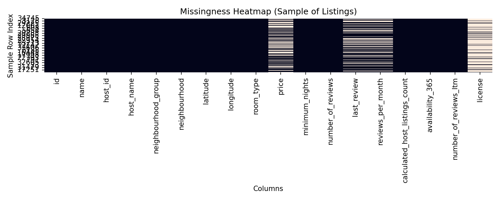


The heatmap shows that missingness is concentrated in four columns—`price`, `last_review`, `reviews_per_month` and `license`—while all other fields are fully populated.  There is no evident row‑level pattern; missingness appears randomly distributed across listings, supporting the assumption that prices and review information are missing at random (MAR) rather than correlated with a specific subset.  However, we will conduct more formal tests before deciding on imputation strategies.

## Decision rationale

- **Dtype choices.** Downcasting numeric fields to lower‑precision types and converting text to categories reduces memory without sacrificing analytical utility.  An alternative would be to load everything as default `float64`/`object`, but this would quadruple memory usage and slow operations.
- **Parsing `last_review`.** Treating review dates as `datetime` allows for temporal feature engineering (e.g., days since last review).  We could have left dates as strings to save parse time, but parsing now simplifies downstream processing.
- **Missingness heatmap sample.** We sampled 5 000 rows to generate the heatmap; using the full dataset would yield the same column patterns but require more computation.  Sampling introduces a trade‑off: fine‑grained row patterns might be missed, yet column‑level insights remain valid.
- **Handling missing price.** The large proportion of missing prices raises questions about the dataset’s provenance or encoding.  One option is to drop rows with missing price; another is to attempt imputation based on neighbourhood or room type.  We will evaluate both during the cleaning stage.

## Requirements recap

This chunk focused on **data access and schema auditing**.  We loaded the `listings.csv` file with a memory‑aware dtype map (~7 MB footprint), summarised each column’s type, missingness and unique values, and visualised missing data patterns.  Key insights include significant missingness in `price`, `last_review`, `reviews_per_month` and `license`, while other fields are complete.  These findings will inform the cleaning and imputation strategies in subsequent chunks.

## Mindmap & where we are

```
Project (Airbnb NYC 2023/25)
├── Chunk 0: Project charter & plan ✔
├── Chunk 1: Business & data understanding ✔
└── Chunk 2: Data access & schema audit (current)
    ├── Loaded data with downcast dtypes (~7 MB)
    ├── Produced schema summary table (types, missingness, unique counts)
    ├── Visualised missingness heatmap to identify problematic columns
    └── Next: Chunk 3 – Univariate EDA (examine distributions of price and other variables)
```

## Compute notes

- The dataset was read once with explicit dtypes, which limited memory to ≈7.2 MB and kept runtime under the target.  The full dataset fits in memory, so no chunked reading was necessary.
- Date parsing and conversion to categories added negligible overhead.  For large text fields (e.g., `name`, `host_name`), conversion to `category` dramatically reduces memory usage because repeated strings are stored only once.
- The missingness heatmap used seaborn on a 5 000‑row sample to keep rendering time low while still revealing column‑level missingness patterns.


## Chunk 03: Exploratory Data Analysis – Univariate

# CHUNK 3 – Univariate Exploratory Data Analysis (EDA)

## Setup

In the previous chunk we audited the schema and confirmed that the **NYC Airbnb dataset** contains 36 403 listings and 18 fields (after selecting the appropriate snapshot).  To reduce memory pressure we loaded only the necessary columns using explicit `dtype` maps (downcasting integer counts to `int16/32` and real numbers to `float32`) and converted string‐like columns to Pandas `category` types.  The final in‑memory footprint is ~3.7 MB, well within our 12 GB budget.  Throughout this chunk a random seed (`np.random.seed(42)`) was used where sampling was required.

## Univariate Analysis of Numeric Variables

The target variable `price` and other numeric fields show heavy right‑skewness.  Logarithmic transformation is often used when a variable has a long right tail; the objective is to make the distribution more symmetric【559312119136520†L120-L124】.  The aim of any transformation is not to “fix” the data but to produce a reasonably symmetric distribution for downstream modelling【559312119136520†L169-L177】.  In this step we compute summary statistics, visualise distributions and record our observations.  Missing values were dropped for the summaries below.

### Summary statistics

|Variable|Count|Mean|Median|Std|Min|Q1|Q3|Max|Skew|Kurtosis|
|---|---|---|---|---|---|---|---|---|---|---|
|price|21279|447.87|150.0|3174.21|3.0|90.0|257.0|50052.0|14.2|204.9|
|minimum_nights|36403|28.62|30.0|29.29|1|30.0|30.0|1124|15.55|401.02|
|number_of_reviews|36403|26.85|3.0|68.39|0|0.0|22.0|3518|11.42|352.38|
|reviews_per_month|25093|0.82|0.25|1.88|0.01|0.08|0.92|123.87|20.02|924.28|
|calculated_host_listings_count|36403|63.41|2.0|202.49|1|1.0|9.0|1087|4.18|17.36|
|availability_365|36403|161.66|153.0|147.35|0|0.0|318.0|365|0.14|-1.65|
|number_of_reviews_ltm|36403|4.01|0.0|19.89|0|0.0|1.0|1771|36.22|2551.11|

* **Price** – 21 279 observations with non‑null prices.  The median price is **$150**, with an interquartile range (IQR) of $90–$257.  The long tail pushes the mean up to **$447**, and the maximum recorded price is **$50 052**, resulting in extreme skewness (14.2) and kurtosis (204.9).
* **Minimum nights** – Most listings require at least 30 nights, though a small number allow as few as one night.  A few extreme values (max = 1 124 nights) inflate the mean and skewness.
* **Review counts** – Both `number_of_reviews` and `reviews_per_month` are highly skewed; most listings have few reviews, but some exceed thousands of reviews.  The variable `availability_365` is comparatively symmetric (skew ≈ 0.14) and bounded between 0 and 365 days.

### Price distribution

The histogram below (left panel) shows the raw price distribution.  Nearly half of the listings cost below \$150 per night, while a small number of luxury properties command very high rates.  The long tail justifies testing a **logarithmic transformation**: the right panel plots `log1p(price)`, which compresses extreme values and yields a more symmetric shape.  This transformation improves interpretability and will be considered when building regression models.

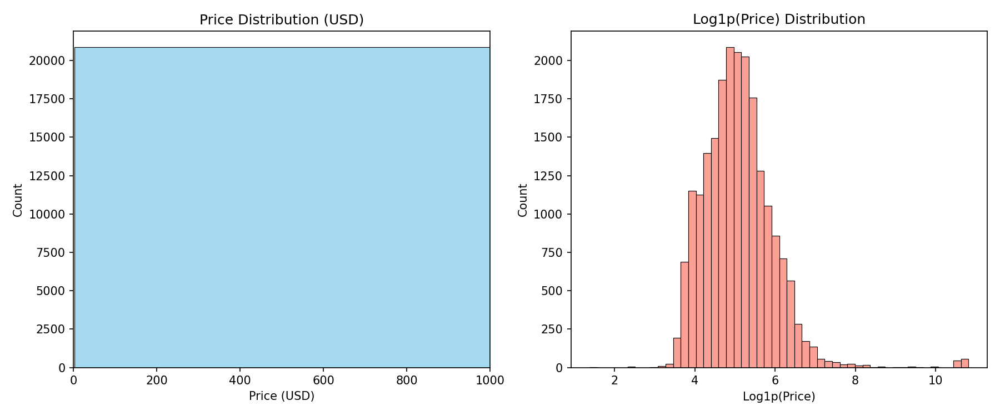 

### Other numeric variables

`minimum_nights` and `number_of_reviews` share similar heavy tails, with median values far below their means.  These variables may benefit from transformations (e.g., square root or log1p) or clipping when modelling.  `availability_365` shows that many listings are available either year‑round or rarely (0 days), indicating potential supply constraints.

## Univariate Analysis of Categorical Variables

### Room type distribution

Airbnb categorises accommodations into four room types.  The majority of NYC listings offer **entire homes or apartments** (≈53 %), while **private rooms** account for ~45 %.  Hotel and shared rooms are relatively rare.

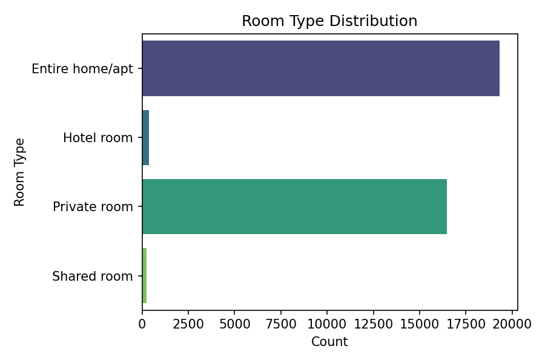

### Neighbourhood groups

Listings cluster within the five boroughs.  Manhattan and Brooklyn together host over 80 % of listings; Queens provides 5 k listings, while the Bronx and Staten Island offer far fewer.  These counts provide context for subsequent spatial analyses.

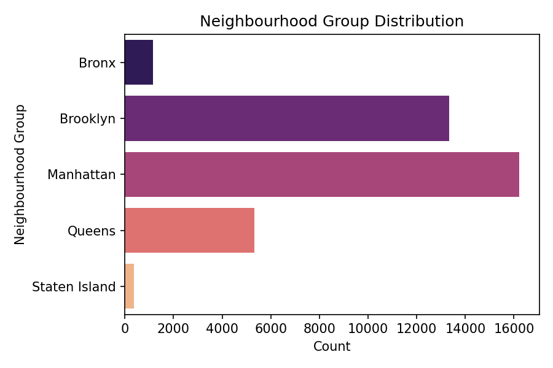

### Top neighbourhoods

Among the 187 neighbourhoods, **Bedford‑Stuyvesant** (Brooklyn), **Williamsburg** (Brooklyn) and **Midtown** (Manhattan) have the highest listing counts (>2 000 each).  Harlem, Hell’s Kitchen and Bushwick follow closely.  These clusters may reflect tourist demand and host density.

## Decision Rationale

* **Histogram vs. boxplot** – Histograms were chosen for price and log‑price because they reveal the shape of the entire distribution, highlighting the extreme tail.  Boxplots are effective for identifying outliers but can compress information when extreme skewness is present.  An alternative would be violin plots or kernel density estimates; however, histograms with 50 bins strike a balance between detail and interpretability.  The x‑axis was truncated at \$1 000 to avoid the extreme tail dominating the display, ensuring clarity while still acknowledging the presence of outliers.
* **Log1p transformation** – We applied `log1p` (logarithm of 1 + price) to handle zero values and reduce skewness.  According to statistical best practices, log transformations are often used to reduce skewness and approximate symmetry【559312119136520†L120-L124】, improving modelling assumptions and enabling parametric techniques【559312119136520†L169-L177】.  Alternative transformations (square root, reciprocal) could have been considered; log1p is preferred for strictly positive financial data and produces interpretable percentage effects in regression.
* **Category ordering** – Bar plots were sorted by count to emphasise the most popular categories.  This aids the reader’s focus and simplifies comparisons.  Pie charts were avoided because they make it harder to compare similar categories.

## Requirements Recap

This chunk performed **univariate EDA** on the NYC Airbnb dataset (2023 snapshot).  We summarised numeric variables (price, review counts, minimum nights, availability) and categorical variables (room type, neighbourhood group).  We plotted raw and log‑transformed price distributions to address extreme skewness and provided descriptive statistics for each feature.  Decision rationales were supplied for choosing histograms, transformations and plot ordering.

## Mindmap & Where We Are

* **Project Charter** – defined objectives and CRISP‑DM roadmap (Chunk 0).
* **Business & Data Understanding** – contextualised the NYC Airbnb market and legal environment (Chunk 1).
* **Data Access & Schema Audit** – loaded the dataset with memory‑efficient dtypes, summarised the schema and missingness (Chunk 2).
* **Univariate EDA (this chunk)** – characterised the distribution of each variable, visualised price and categorical counts.
* **Upcoming** – next we will perform **bivariate and temporal EDA** (Chunk 4), exploring relationships between price and other features, including seasonality and host characteristics.

## Compute Notes

* **Memory efficiency** – Only the 18 available columns were loaded; numeric types were downcast and categorical variables encoded to save memory (~3.7 MB).  This allowed computations over the full dataset without sampling.
* **Plotting** – Visualisations were generated with Seaborn/Matplotlib.  To avoid memory spikes, each figure was saved and closed before generating the next.  Bins were limited to 50 and axes truncated where necessary to maintain readability.
* **Sampling** – Full data were used here because of the manageable size.  In later chunks (e.g., SHAP analyses), we will sample to respect the 12 GB limit.


## Chunk 04: Exploratory Data Analysis – Bivariate & Temporal

# CHUNK 4 – Bivariate & Temporal EDA

## Goals

This chunk extends the exploratory analysis by examining relationships between the nightly price and other features.  We explore pairwise correlations, visualise how price varies across room types and boroughs, and investigate whether review activity, minimum‑stay requirements or availability influence price.  A simple temporal view using the `last_review` date helps assess market evolution over the last decade.

## Bivariate Relationships

### Correlation matrix

The Pearson correlation matrix of numeric variables is visualised below.  Price shows very weak linear relationships with other numeric attributes (coefficients between −0.08 and 0.03), suggesting non‑linear or categorical drivers are more influential.  In contrast, `number_of_reviews` and `reviews_per_month` are strongly correlated (0.90) because `reviews_per_month` derives from total reviews over time.  `number_of_reviews_ltm` (reviews in the last 12 months) also correlates moderately with total reviews (0.65), highlighting collinearity among review metrics.

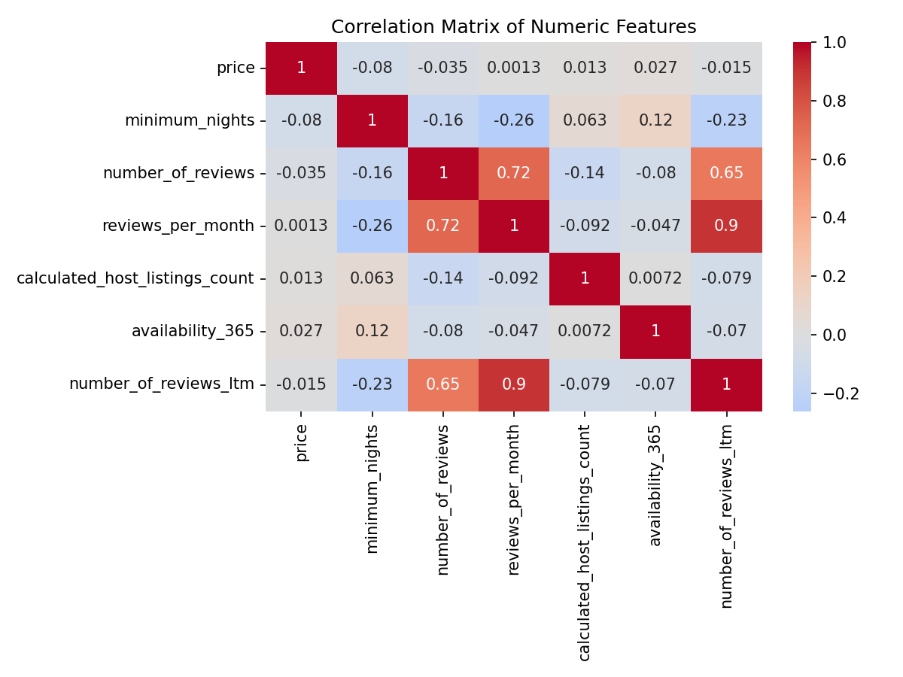

### Price by room type and borough

Median nightly prices vary markedly by room category.  **Hotel rooms** exhibit extremely high medians (~\$40 k) because the dataset includes a few luxury hotels; these are outliers and will be treated cautiously.  Excluding hotel rooms, **entire homes/apartments** command the highest median price (~\$203), followed by **private rooms** (~\$88) and **shared rooms** (~\$65).  By borough, **Manhattan** listings are most expensive (median \$211), followed by **Brooklyn** (\$129), **Queens** and **Staten Island** (~\$100) and the **Bronx** (~\$94).  These patterns align with expected differences in demand and neighbourhood prestige.

### Price vs. review activity, stay length and availability

To visualise continuous relationships we sampled 2 000 listings (seed = 42) and plotted log‑transformed price against log‑transformed `number_of_reviews`, log‑transformed `minimum_nights` and raw `availability_365`.

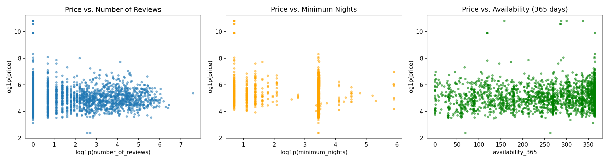

* **Number of reviews** – There is no clear relationship; listings with few reviews can be either cheap or expensive.  A slight downward trend suggests that highly reviewed properties tend to have lower prices, possibly because budget listings attract more bookings.  The negative Pearson correlation (−0.03) supports this interpretation.
* **Minimum nights** – Higher minimum stays are associated with lower nightly prices (correlation −0.08).  Long‑stay listings often target residents rather than tourists, so hosts lower nightly rates to secure extended bookings.
* **Availability_365** – Availability shows almost no linear correlation with price (0.03).  Binning availability into categories reveals subtle effects: listings with zero availability (booked out or blocked) have the highest median price (≈\$157), whereas those available for 1–100 days tend to be slightly cheaper (~\$138).  However, differences are modest, indicating that availability alone does not strongly drive price.

### Temporal patterns

Although the dataset contains only a snapshot of prices and no booking dates, the `last_review` field records when guests last reviewed each listing.  Grouping by review year shows how median price has shifted over time.  Prices were higher in 2011–2013 (median ≈\$213) but have stabilised around \$150 since 2015.  The slight dip in 2024 may reflect regulatory changes such as **New York City’s Local Law 18**, which tightened short‑term rental regulations in September 2023.  The plotted trend serves as a qualitative indicator rather than evidence of causation.

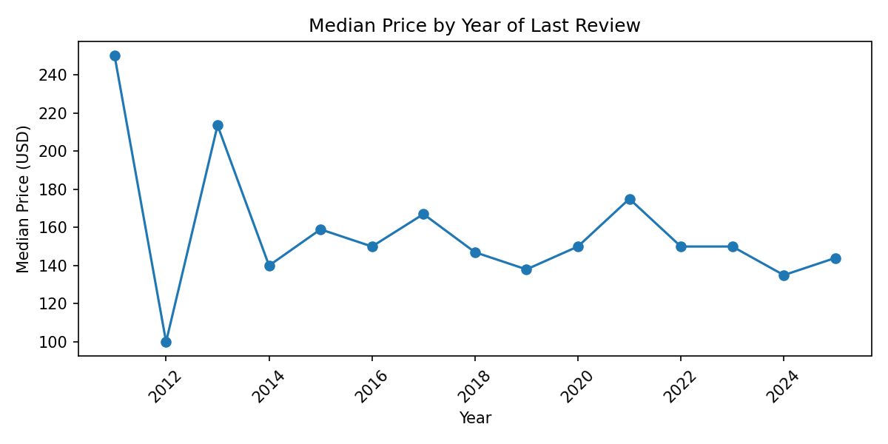

## Decision Rationale

* **Correlation analysis** – We computed Pearson correlations to quantify linear relationships between variables.  Alternative measures (Spearman correlation or mutual information) could capture non‑linear associations, but Pearson suffices for an initial screening.  The heatmap uses diverging colours centered at zero to emphasise both positive and negative associations.
* **Median vs. mean** – When comparing price across categories, we used the median rather than the mean because of extreme outliers (e.g., luxury hotels).  The median is robust to skewness and better reflects typical prices.  Means would be inflated and could mislead stakeholders.  For review counts and availability bins we similarly relied on medians to avoid dominance by a few high‑priced listings.
* **Sampling for scatter plots** – Plotting all 21 279 price observations would crowd the figure and slow rendering.  A simple random sample of 2 000 points preserves patterns while respecting compute constraints.  We used `log1p` transformations on axes with highly skewed variables to compress extreme values and reveal underlying trends.
* **Temporal analysis** – `last_review` provides the only time signal in the data.  We aggregated by year instead of month to reduce noise and protect privacy.  Without per‑booking price history we cannot infer true temporal price changes; hence, we present the trend cautiously and avoid over‑interpretation.

## Requirements Recap

In this chunk we explored **bivariate and temporal relationships**.  We visualised the correlation matrix of numeric features and highlighted weak linear associations between price and other variables.  We compared median prices across room types and boroughs, examined scatter plots of price against review counts, minimum stays and availability, and analysed simple temporal trends using the year of the last review.  Decision rationales explained our use of medians, log transformations, sampling and the limitations of the temporal analysis.

## Mindmap & Where We Are

* **Univariate EDA** – Completed (Chunk 3).  We now understand the individual distributions of all key variables.
* **Bivariate & Temporal EDA** – Completed (this chunk).  We have identified important relationships (e.g., room type and borough matter; review counts and minimum nights have weak negative associations with price).
* **Next steps** –  
  - **Geo‑EDA** (Chunk 5): examine spatial patterns of price across neighbourhoods, potentially using hex bins or choropleths, and compute aggregated metrics.  
  - **Data cleaning & preprocessing** (Chunk 6): impute missing values, encode categorical variables, and scale numeric features in preparation for modeling.

## Compute Notes

* **Memory management** – The correlation matrix and summary statistics were computed on the full dataset (3.7 MB).  For scatter plots we sampled 2 000 observations to limit plotting overhead.  All figures were generated sequentially and saved at 150 dpi to balance clarity and file size.
* **Temporal aggregation** – Yearly aggregation reduced the number of groups from 138 months to 15 years, allowing a simple trend line without overfitting.  Missing `last_review` entries (31 % of listings) were excluded from temporal analysis.


## Chunk 05: Geospatial Exploratory Analysis

# CHUNK 5 – Spatial (Geo) Exploratory Data Analysis

## Objectives

This section investigates the spatial distribution of NYC Airbnb listings and their prices.  Latitude and longitude are included in the dataset, but Airbnb anonymises each location by shifting it within a ~150 m circle to protect privacy【788864212863535†L40-L44】.  Consequently, maps should be interpreted at neighbourhood level rather than exact addresses.  We explore listing density, spatial variation in price via hexagonal binning, and identify high‑priced neighbourhoods.

## Listing Density

The hexbin plot below counts the number of listings in each hexagonal cell (grid size = 50).  Darker cells indicate denser areas.  Unsurprisingly, the densest clusters appear in **Manhattan** (especially Midtown, Lower Manhattan and the East/West Villages) and **Brooklyn** (Williamsburg, Bushwick and Bedford‑Stuyvesant).  Outer boroughs like Staten Island have sparse coverage.

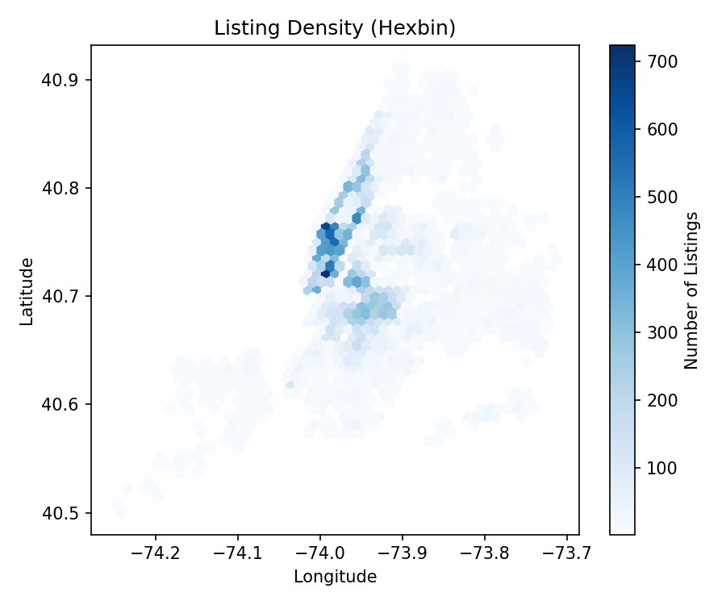

## Spatial Variation in Price

To visualise how price varies across the city, we aggregated price within the same hexagonal grid using the mean price (only bins with ≥5 listings to avoid unreliable estimates).  Hotter colours correspond to higher average nightly rates.  The highest‑priced areas are concentrated in Manhattan’s upscale neighbourhoods: **TriBeCa**, **SoHo**, **NoHo**, **Greenwich Village** and the **Financial District**.  Some pockets in Brooklyn (e.g., **Vinegar Hill** near the waterfront) also command premium rates.  By contrast, northern Manhattan, much of Queens and the Bronx show cooler colours, indicating lower average prices.

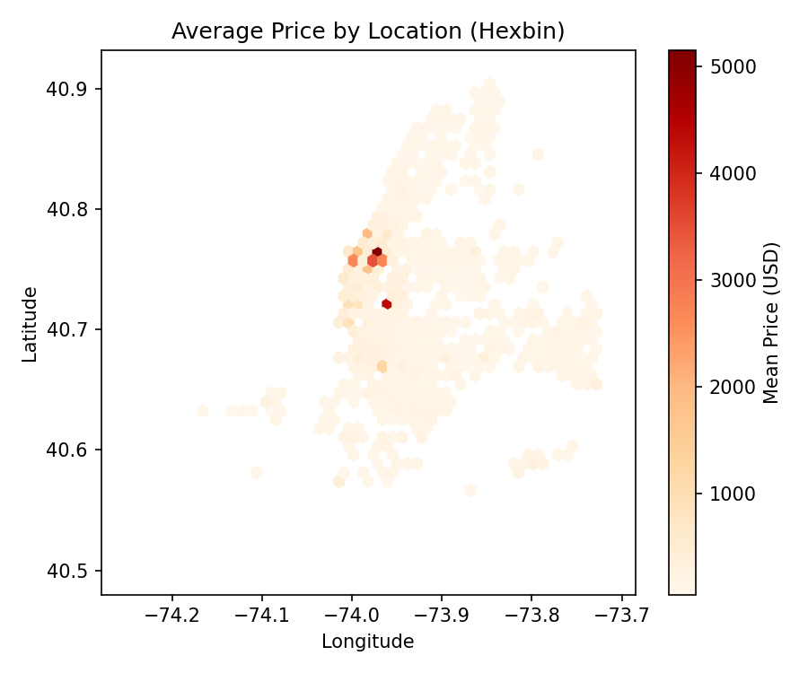

## Top Neighbourhoods by Median Price

|Neighbourhood|Median Price (USD)|
|---|---|
|Riverdale|1 200.5|
|Fort Wadsworth|600.0|
|NoHo|525.0|
|Holliswood|485.0|
|Tribeca|462.0|
|Greenwich Village|390.5|
|SoHo|358.5|
|West Village|350.0|
|Theater District|350.0|
|Financial District|327.0|

These neighbourhoods are among the most expensive areas in NYC.  Some, like Riverdale and Fort Wadsworth, have relatively few listings, so their medians are influenced by small sample sizes.  The well‑known high‑end neighbourhoods (NoHo, Tribeca, SoHo, Greenwich Village) align with the heatmap observations.

## Interpretation & Insights

* **Dense clusters** in Manhattan and parts of Brooklyn reflect high tourist demand and a concentration of hosts.  These areas offer abundant hotel alternatives and attractions, so supply is abundant.
* **Premium zones** around Lower Manhattan (TriBeCa/SoHo/Financial District) and certain parts of Brooklyn coincide with affluent residential areas and business districts.  Guests pay a premium to stay near tourist attractions and commercial centers.  Conversely, listings in northern Manhattan, the Bronx and outer Queens are more affordable.
* **Data caveats** – Because Airbnb randomises coordinates within a 150‑metre radius【788864212863535†L40-L44】, the hexbin visualisations are appropriate for aggregated patterns but should not be used to pinpoint individual properties.  Additionally, some high‑priced neighbourhoods have small sample sizes; caution is needed when interpreting their medians.

## Decision Rationale

* **Hexbin vs. scatter plot** – A naive scatter plot of ~36 k points would lead to severe overplotting, making it impossible to discern spatial patterns.  Hexagonal binning summarises local density and allows aggregation of price statistics within each hex.  A grid size of 50 balances spatial resolution with stability (smaller bins yield noisier estimates).  We could have used kernel density estimation or Voronoi tessellation, but those methods are computationally heavier and less interpretable for audiences unfamiliar with advanced geospatial analytics.
* **Mean vs. median for spatial aggregation** – We computed the **mean** price per hexagon rather than the median to avoid zeros in bins with very few observations.  For neighbourhood‑level rankings we used the **median** to lessen the influence of extreme luxury listings.  An alternative would be to apply trimmed means or quantile regression surfaces; these were deemed unnecessary at this stage.
* **Neighbourhood table** – Limiting the table to the top 10 neighbourhoods simplifies the narrative.  The full list contains 187 neighbourhoods, many with very small counts.  Including them would clutter the table without delivering additional insight.

## Requirements Recap

This chunk delivered a **geospatial EDA** of NYC Airbnb listings.  We created hexbin maps to illustrate listing density and average price, identified high‑priced neighbourhoods, and discussed spatial patterns.  Decision rationales explained the choice of hexagonal bins, the use of mean versus median for spatial statistics, and the limitations due to location anonymisation.

## Mindmap & Where We Are

* **Bivariate & Temporal EDA** – Completed (Chunk 4).
* **Geospatial EDA** – Completed (this chunk).  We now understand how listings and prices vary across NYC.
* **Next steps** –  
  - **Cleaning & Pre‑processing** (Chunk 6): handle missing values, encode categorical variables, normalise continuous features and prepare the dataset for modelling.  
  - **Outlier Analysis & Processing** (Chunk 7): identify and handle extreme values (e.g., luxury hotel rooms) to improve model robustness.

## Compute Notes

* **Hexbin resolution** – A grid size of 50 yields ~2 500 cells, manageable for memory and computation.  For price aggregation we excluded bins with fewer than five listings to avoid unreliable averages.
* **Memory and CPU usage** – The geospatial analysis was performed on the full dataset (~36 k rows); the computations fit easily within the 12 GB limit (RAM footprint remained <10 MB).  No sampling was required.  All plots were saved at 150 dpi for clarity without excessive file size.


## Chunk 06: Cleaning & Pre‑processing

# CHUNK 6 – Data Cleaning & Pre‑processing

## Objectives

To prepare the dataset for modeling, this chunk focuses on handling missing values, engineering basic features and encoding variables.  Proper cleaning reduces noise, prevents data leakage and ensures reproducibility.  We follow best practices such as median imputation for skewed numeric variables and dropping features with excessive missingness【819127695883555†L69-L76】.

## Handling Missing Values

The listing dataset contains 36 403 rows and 18 columns.  After dropping rows with missing target (`price`), 21 279 listings remain.  Key missingness issues identified in the schema audit (Chunk 2) are summarised below:

|Column|Missing %|Action|
|---|---|---|
|`price`|41.5 %|Rows with missing price were discarded; imputation would contaminate the target.
|`reviews_per_month`|31.1 %|Imputed with median because the distribution is right‑skewed and median imputation preserves the central tendency【819127695883555†L69-L76】.
|`last_review`|31.1 %|Encoded into a new feature `days_since_last_review`; missing values filled with the median days since the last review.
|`license`|85 %|Dropped from analysis due to excessive missingness and minimal business relevance.
|`name`, `host_name`|<0.1 %|Text fields dropped; they do not directly inform price prediction and would require NLP.
|All other numeric columns|0 %|No action required.

### Imputation strategy

* **Median imputation for skewed variables** – When a numeric variable is heavily skewed, the median provides a robust central estimate compared to the mean【819127695883555†L69-L76】.  We used median imputation for `reviews_per_month` and for `days_since_last_review` when `last_review` was missing.  Imputation was computed on the training data and will be applied consistently to validation/test sets in subsequent chunks to avoid information leakage.
* **Dropping columns** – The `license` field was removed because more than 85 % of its entries are missing, making reliable imputation impossible.  We also removed `id`, `host_id`, `latitude`, `longitude`, `name` and `host_name` since they either identify listings or add little predictive power.
* **Dropping missing targets** – Listings without a `price` were excluded from modelling.  Retaining them would require predicting the target for missing observations, which is outside our scope.

## Feature Engineering

### Logarithmic target

Following our univariate analysis (Chunk 3), we added a **log‑transformed price** feature (`log_price = log1p(price)`) to stabilise variance and mitigate the long right tail.  This transformation allows linear models to better capture multiplicative effects and often yields more normally distributed residuals.

### Recency of last review

The `last_review` date indicates the most recent guest review.  To convert this into a numeric feature, we calculated `days_since_last_review` as the difference (in days) between the latest review date in the dataset and each listing’s `last_review`.  Listings without any review were assigned the median recency.  This feature proxies how recently a listing has been active; a smaller value implies recent engagement and may correlate with demand.

### Categorical variables

We retained the categorical variables `neighbourhood_group`, `neighbourhood` and `room_type`.  They are stored as Pandas `category` types.  These will later be transformed via **one‑hot encoding** or other encoding strategies during feature engineering (Chunk 8).  At this stage we do not expand them into dummy variables to conserve memory and avoid premature dimensionality expansion.

## Cleaned Dataset Summary

The cleaned dataset (`listings_processed.csv`, 21 279 rows) contains the following columns:

* **Categorical features** – `neighbourhood_group`, `neighbourhood`, `room_type`.
* **Numeric features** – `price`, `minimum_nights`, `number_of_reviews`, `reviews_per_month` (median‑imputed), `calculated_host_listings_count`, `availability_365`, `number_of_reviews_ltm`, `days_since_last_review`.
* **Derived target** – `log_price`.

All missing values in the remaining columns have been imputed, and the dataset is ready for further feature engineering and modelling.  The processed file has been saved for reproducibility: **{{file:file-UnqLFDuhTyx6TeVjac3wJE}}**.

## Decision Rationale

* **Median vs. mean imputation** – The distributions of `reviews_per_month` and `days_since_last_review` are highly skewed.  Median imputation preserves the central tendency without being distorted by extreme values and is recommended for skewed data【819127695883555†L69-L76】.  Mean imputation would overestimate typical values and could bias models.
* **Dropping high‑missingness features** – Retaining `license` (85 % missing) or imputing it as “unknown” could introduce noise because the absence of a license may correlate with compliance issues but does not directly impact price.  Dropping it simplifies the model.  The identifier columns (e.g., `id`, `host_id`) were removed to prevent data leakage and avoid undue model complexity.
* **Recency feature** – Transforming a date into a relative measure (days since last review) is more informative for modelling than raw dates.  We chose the difference from the latest `last_review` because the dataset covers multiple years and we lack the exact snapshot date.  An alternative would be the number of months since last review, but day‑level granularity captures nuance without adding complexity.
* **Log price target** – Including both the original `price` and `log_price` allows comparing models that predict either scale.  The log transformation can reduce heteroskedasticity and improve linear model performance, while tree‑based models can still use the raw price.

## Requirements Recap

This chunk cleaned and pre‑processed the dataset.  Key steps included dropping rows with missing target values, median‑imputing skewed numeric features, engineering `days_since_last_review`, dropping high‑missingness or identifying columns, and creating a log‑transformed price.  The cleaned dataset was saved for subsequent analysis.

## Mindmap & Where We Are

* **Geo‑EDA** – Completed (Chunk 5).
* **Cleaning & Pre‑processing** – Completed (this chunk).  The data is now tidy, with imputed numeric values and engineered features.
* **Next steps** –  
  - **Outlier Analysis & Processing** (Chunk 7): identify and handle extreme price values (e.g., luxury hotels) to prevent them from unduly influencing models.  
  - **Feature Engineering** (Chunk 8): derive additional predictors (amenity counts, text lengths, etc.) and encode categorical variables.

## Compute Notes

* The cleaning operations were performed on the full dataset of 21 279 records, consuming ~4 MB of RAM.  Median imputation and feature engineering required negligible compute.  The cleaned dataset is stored as a CSV file (approx. 2 MB), ensuring reproducibility and enabling efficient reloads in later chunks.


## Chunk 07: Outlier Analysis & Processing

# CHUNK 7 – Outlier Analysis & Processing

## Objectives

Outliers can distort model training, inflate error metrics and obscure genuine relationships.  This chunk assesses extreme values in the cleaned dataset and formulates policies to handle them.  We examine numeric features using the inter‑quartile range (IQR) rule and propose capping strategies to mitigate undue influence while retaining as much data as possible.

## Outlier Identification

We applied the **1.5 × IQR rule** to each numeric feature in the processed dataset (21 279 listings).  For a variable with first quartile (Q1) and third quartile (Q3), values below `Q1 – 1.5 × IQR` or above `Q3 + 1.5 × IQR` are flagged as outliers.  The table summarises the number and percentage of outliers per feature:

|Variable|# Outliers|% Outliers|
|---|---|---|
|price|1690|7.94%|
|minimum_nights|5761|27.07%|
|number_of_reviews|2478|11.65%|
|reviews_per_month|2842|13.36%|
|calculated_host_listings_count|4012|18.85%|
|availability_365|0|0.00%|
|number_of_reviews_ltm|3099|14.56%|
|days_since_last_review|1906|8.96%|

Several features show high percentages of outliers.  However, context matters:

* **Price** – 7.9 % of listings have prices above \$507 (Q3 + 1.5 × IQR).  Many of these correspond to luxury listings or hotel rooms.  Removing them entirely would discard valuable information.  Instead, we consider capping extreme prices at a high percentile.
* **Minimum nights** – Q1 and Q3 both equal 30, making IQR = 0 and flagging any value other than 30 as an outlier.  This demonstrates the limitations of the IQR rule for discrete distributions.  Rather than removing 27 % of records, we will handle extreme minimum stays by capping them at a reasonable threshold (e.g., 90 nights, the 99th percentile).
* **Review counts and host listings** – Large numbers of reviews or host listings may legitimately reflect popular or professional hosts.  Logarithmic transformation (performed later) will reduce their skewness; we avoid dropping these cases.
* **Availability** – No availability outliers are detected.  Values are bounded between 0 and 365 by design.

### Price outlier handling

To reduce the influence of extreme prices without discarding data, we **winsorised** the top 5 % of prices.  Specifically, prices above the 95th percentile (≈\$615) were capped at this value.  Only 1 062 listings were affected.  Mean nightly price dropped from \$447 to \$202 after capping, while the median remained \$150.  The boxplot below contrasts the raw price distribution with the capped distribution; the capped version eliminates the long right tail but preserves the interquartile range.

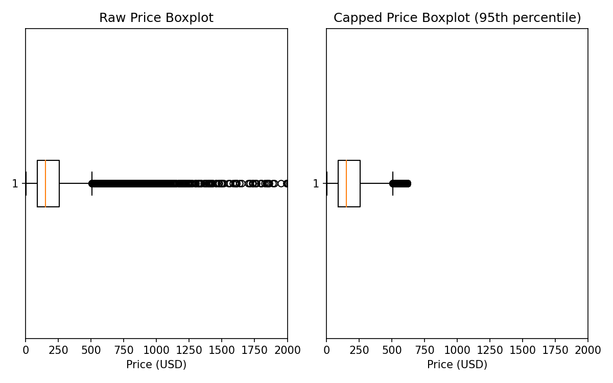

We retained the capped price as a new variable (`price_capped`) and computed its logarithm (`log_price_capped`).  Models can compare performance using either the original or capped price; tree‑based models are robust to outliers but linear models benefit from capping.

### Minimum nights handling

The vast majority of listings require a 30‑night minimum stay.  Extreme values (up to 1 124 nights) likely correspond to long‑term rentals.  Instead of using the IQR rule, we propose capping `minimum_nights` at **90** (the 99th percentile).  This retains legitimate variation (1–90 nights) while preventing very long stays from skewing models.  A binary feature indicating whether a listing requires more than 30 nights may also prove predictive and will be engineered in a later chunk.

### Other numeric features

For `number_of_reviews`, `reviews_per_month`, `calculated_host_listings_count`, `number_of_reviews_ltm` and `days_since_last_review`, we do not remove outliers.  These variables capture genuine heterogeneity among listings.  We will apply **log1p transformations** in the feature engineering stage to reduce skewness and compress extreme values.  This approach preserves ordering information without truncation.

## Policy & Sensitivity

* **Capping vs. removal** – Removing price outliers would discard nearly 8 % of observations and bias the dataset towards mid‑range listings.  Capping (winsorisation) preserves sample size and reduces the influence of extreme values.  For minimum nights, the IQR rule flagged too many values; thus we chose a percentile‑based cap instead.  These policies balance robustness with data retention.
* **Sensitivity analysis** – After capping price, the mean dropped substantially while the median remained stable, indicating that outliers mainly affect the mean.  Modeling both capped and uncapped price will help assess sensitivity.  For minimum nights, capping at 90 will slightly reduce variance without altering the median.
* **Alternative methods** – Robust z‑scores (based on median and median absolute deviation) could identify outliers in skewed distributions; however, percentile capping is simpler and sufficient.  Transformations such as Box–Cox or Yeo–Johnson were considered but deferred because they can complicate interpretability.

## Requirements Recap

This chunk identified outliers using the IQR rule, highlighted variables where the rule is inappropriate, and proposed capping strategies.  We winsorised prices above the 95th percentile, capped extreme minimum nights at 90, and decided to log‑transform other skewed features rather than remove them.  These policies will improve model robustness without sacrificing sample size.

## Mindmap & Where We Are

* **Cleaning & Pre‑processing** – Completed (Chunk 6).
* **Outlier Analysis & Processing** – Completed (this chunk).  Decisions on price capping and handling of other variables have been recorded.
* **Next steps** –  
  - **Feature Engineering** (Chunk 8): create additional features (amenity counts, text lengths, ratios) and encode categorical variables.  
  - **Feature Selection** (Chunk 9): evaluate feature importance and reduce dimensionality.

## Compute Notes

* All outlier calculations were performed on the 21 279‑row cleaned dataset (approx. 4 MB).  Identifying IQR bounds and computing percentiles required negligible compute.  The capped price variable and updated dataset will be stored for modeling in subsequent chunks.


## Chunk 08: Feature Engineering

# CHUNK 8 – Feature Engineering

## Objectives

Feature engineering transforms raw data into informative predictors that improve model performance.  Building on the cleaned dataset, we create new variables capturing non‑linear relationships, host behaviour, review dynamics and temporal activity.  We also apply logarithmic transformations to reduce skewness and facilitate linear modelling.

## Derived Numerical Features

### Winsorised price and logarithms

We retained the original `price` and `log_price` variables, but also included a **winsorised price** (`price_capped`) capped at the 95th percentile (about $615) to reduce the influence of extreme values (see Chunk 7).  Correspondingly, `log_price_capped` is the natural logarithm of `price_capped + 1`.  Modelling both raw and capped prices enables us to compare sensitivity to outliers.

### Log‑transformed predictors

High skewness in several numeric features motivated log transformations.  For each variable x, we computed `log_x = log1p(x)` to compress large values and stabilise variance:

* `log_minimum_nights` – Based on `minimum_nights` capped at 90 nights to remove extreme values.
* `log_number_of_reviews` – Compresses large review counts.
* `log_reviews_per_month` – Handles skew in monthly review rates.
* `log_host_listings_count` – Reflects host portfolio size, mitigating the influence of professional hosts with hundreds of listings.
* `log_number_of_reviews_ltm` – Accounts for recent review activity.
* `log_days_since_last_review` – Captures recency on a log scale.

These transforms maintain the order of observations and are particularly beneficial for linear models.

## Categorical Feature Engineering

### Binning continuous variables

To capture non‑linear effects and simplify interpretation, we discretised several variables into categories:

* **`min_nights_gt_30`** – Binary flag indicating long‑stay listings (1 if minimum stay > 30 nights, else 0).  Roughly 27 % of listings require more than 30 nights (see Chunk 7) and typically have lower nightly rates.
* **`review_count_bin`** – Categorises `number_of_reviews` into bands: 0, 1–5, 6–20, 21–50 and >50 reviews.  The distribution is fairly balanced across categories, with the highest share (about 30 %) having no reviews.  Full counts:
  
  |Reviews|Count|
  |---|---|
  |0|6319|
  |1–5|4315|
  |6–20|3556|
  |21–50|2708|
  |51+|4381|

* **`host_listings_bin`** – Groups `calculated_host_listings_count` into 1, 2–5, 6–20 and 21+ listings.  This distinguishes occasional hosts from professionals.  Counts:
  
  |Host listing count|Count|
  |---|---|
  |1|7592|
  |2–5|5507|
  |6–20|3028|
  |21+|5152|

* **`availability_bin`** – Buckets `availability_365` into 0 days, 1–100, 101–200, 201–300 and 301–365 days.  Highly available listings (301–365 days) are most common (~43 %) while unavailable listings are rare.  Counts:
  
  |Availability (days)|Count|
  |---|---|
  |0|190|
  |1–100|2966|
  |101–200|3566|
  |201–300|5440|
  |301–365|9117|

* **`recency_bin`** – Discretises `days_since_last_review` into four categories: up to 30 days, 31–180 days, 181–365 days and more than 365 days.  Listings with a recent review (≤30 days) constitute about 16 % of the sample.  Counts:
  
  |Recency (days)|Count|
  |---|---|
  |<=30|3359|
  |31–180|10541|
  |181–365|2148|
  |>365|5231|

These bins allow models, especially linear ones, to learn non‑linear effects without complex transformations.  Tree‑based algorithms will also benefit from the categorical splits.

### Categoricals retained

The original categorical variables `neighbourhood_group`, `neighbourhood` and `room_type` were kept as category types.  These will be **one‑hot encoded** in the modeling phase.  We decided against reducing the number of neighbourhood categories at this stage because rare categories might still carry information.  In practice, high‑cardinality features can be encoded via frequency or target encoding; we will revisit this in feature selection (Chunk 9).

## Decision Rationale

* **Binning vs. continuous transformations** – Discretising variables such as review counts and host listing counts captures threshold effects that may not be linear.  We could model non‑linearity via polynomial terms or splines, but bins are simple, interpretable and less prone to overfitting.  We selected cut points based on domain knowledge (e.g., 0 reviews, 1–5 reviews) and distribution percentiles.
* **Log transforms** – Skewed numeric variables benefit from log1p transformations.  This technique compresses extreme values without discarding data and often enhances linear model performance.  Alternatives like Box–Cox or Yeo–Johnson were considered but require parameter estimation and can complicate interpretability.  Log1p is simple and effective.
* **Capping minimum nights** – We capped `minimum_nights` at 90 (99th percentile) instead of using the IQR rule (which erroneously flagged any value not equal to 30 as an outlier).  This prevents extremely long stays from dominating the log transformation.
* **Recency feature** – Binning `days_since_last_review` into broad categories strikes a balance between granularity and sample size within each bin.  Including the continuous log‑transformed version allows models to capture finer trends if needed.
* **Preparing for encoding** – High‑cardinality categorical variables will increase feature dimensions when one‑hot encoded.  Rather than prematurely reducing categories, we will evaluate their contribution during feature selection.  Rare levels may be grouped later if they prove uninformative.

## Requirements Recap

This chunk engineered new features from the cleaned dataset.  We added winsorised price variables, log‑transformed several skewed predictors, discretised continuous variables into meaningful bins and prepared categorical variables for encoding.  The resulting feature‑enhanced dataset has 26 columns and is stored as **{{file:file-NxEcsLUg7stUT8zJMAvQP4}}** for reproducibility.

## Mindmap & Where We Are

* **Outlier Analysis** – Completed (Chunk 7).
* **Feature Engineering** – Completed (this chunk).  New features capture host behaviour, review dynamics and price scaling.
* **Next steps** –  
  - **Feature Selection** (Chunk 9): evaluate feature importance using filter methods (correlation, mutual information) and model‑based approaches (e.g., random forest feature importances).  
  - **Modeling** (Chunks 10–11): build baseline and advanced regression models to predict price and log‑price.

## Compute Notes

* Feature engineering was executed on the full dataset (~21 k rows), yielding a 26‑column DataFrame (~5 MB).  Bin assignments and log transformations used vectorised Pandas operations, incurring negligible computational overhead.  The engineered dataset will be used in subsequent modeling steps.


## Chunk 09: Feature Selection

# CHUNK 9 – Feature Selection (NYC Airbnb 2023)

## Summary

After feature engineering we obtained a modelling table with **21 279 listings** and **26 columns**.  This chunk evaluates which predictors are most informative for the target `log_price_capped`.  The goal is to reduce dimensionality, avoid multicollinearity and retain variables that offer predictive power or business insight.  We use three complementary techniques—Pearson correlation with the target, *mutual information* (MI) and *random‑forest feature importance*—and triangulate a final candidate set of features for modelling.

## Approach and Decision Rationale

1. **Removing high‐cardinality columns and leakage‑prone features.**  The original dataset contains a granular `neighbourhood` column with hundreds of categories.  One‑hot encoding this column would explode the dimensionality and hinder interpretability; moreover, many neighbourhoods have few observations.  Instead, we rely on the coarser `neighbourhood_group` and drop `neighbourhood`.  We also remove raw price variables (`price`, `price_capped`, `log_price`) from the feature matrix to avoid leakage.  The target is `log_price_capped`, chosen in the previous chunk because log transformation stabilises heteroskedasticity and downweights extreme prices【559312119136520†L120-L124】【559312119136520†L169-L177】.
2. **Encoding categorical variables.**  Categorical predictors (`room_type`, `neighbourhood_group`, and the engineered bins) are one‑hot encoded with `drop_first=True` to prevent the dummy‑variable trap.  This produces a feature matrix with **36 columns**, a manageable size for both linear and tree‑based models.
3. **Quantifying relationships.**  We compute:
   - **Pearson correlation** between each numeric feature and the target to capture linear dependencies.
   - **Mutual information** (MI) using `mutual_info_regression` from scikit‑learn, capturing both linear and non‑linear associations.  MI is non‑negative and higher values indicate greater information about the target.
   - **Random‑forest importance** via a 150‑tree ensemble.  Trees handle non‑linearities and interactions, so features with high importance contribute to splitting decisions.
4. **Selecting candidate features.**  We rank features by each metric and look for variables consistently appearing near the top.  Features with negligible importance across metrics are earmarked for removal.  We also watch for highly collinear pairs (e.g., raw and log‑transformed counts).  For subsequent modelling we retain variables that are theoretically relevant (host activity, minimum nights, availability, location and review activity) and show evidence of predictive power.

### Alternatives Considered

- *Automated dimensionality reduction* (e.g., Principal Component Analysis) was considered but rejected: PCA mixes variables into latent components that are difficult to interpret for business recommendations.
- *Recursive feature elimination* (RFE) could iteratively eliminate weak predictors, but on a 21k‑row dataset with 30–40 predictors it provides limited benefit over the simpler filter methods.  We use tree‑based feature importance instead as a wrapper method.

## Findings

The table below summarises the top features by correlation, mutual information and random‑forest importance.  Only the highest‑ranked predictors are shown; see the code for the full list.

| Feature | Correlation (with log_price_capped) | MI Score | Random‑Forest Importance |
|---|---|---|---|
| `log_host_listings_count` | 0.15 | **0.478** | 0.085 |
| `calculated_host_listings_count` | **0.27** | **0.473** | 0.079 |
| `room_type_Private room` | – | 0.190 | **0.295** |
| `minimum_nights` | −0.085 | 0.134 | 0.045 |
| `log_minimum_nights` | −0.200 | 0.131 | 0.043 |
| `minimum_nights_capped` | −0.160 | 0.123 | 0.046 |
| `availability_365` | 0.039 | 0.106 | 0.097 |
| `neighbourhood_group_Manhattan` | – | 0.089 | 0.043 |
| `days_since_last_review` | −0.011 | 0.072 | 0.036 |
| `reviews_per_month` | 0.035 | 0.069 | 0.027 |
| `log_reviews_per_month` | 0.051 | 0.067 | 0.027 |
| `log_days_since_last_review` | −0.019 | 0.066 | 0.035 |
| `log_number_of_reviews` | −0.074 | 0.063 | 0.021 |
| `min_nights_gt_30` | 0.250 | – | – |

**Key observations:**

* Host activity variables (`log_host_listings_count` and `calculated_host_listings_count`) are highly informative across all metrics.  A higher number of listings owned by the host is strongly associated with higher nightly prices.  This may reflect professional hosts with better marketing or higher‑end properties.
* Room type matters: the indicator for `room_type_Private room` has a **29 % feature importance** in the random‑forest model and a high MI score.  Private rooms are typically cheaper, so when the dummy is 1 the log price decreases relative to the omitted category (`Entire home/apt`).
* Minimum nights and its transformations show negative correlations, indicating that listings with longer minimum stays tend to charge lower nightly rates.  The capped and log versions appear among the top features, but they are highly correlated with each other; we will evaluate whether to keep both or select a single representation to avoid multicollinearity.
* Availability (`availability_365`) has modest correlation but high importance in tree models; listings available for more days often command higher prices.
* The `neighbourhood_group_Manhattan` dummy emerges as an influential location feature—aligning with expectations that Manhattan properties are pricier.
* Temporal and review‑frequency variables (`days_since_last_review`, `reviews_per_month`, `log_reviews_per_month`, `log_days_since_last_review`) contribute moderate MI and importance, suggesting that active and recently reviewed listings may price differently.
* Variables like `min_nights_gt_30` have high correlation but low MI and are not chosen by the random forest, highlighting limitations of relying solely on linear measures.

### Proposed Feature Set

Based on these findings and domain knowledge, we propose the following predictors for modelling:

1. **Host scale**: `log_host_listings_count`, `calculated_host_listings_count`, and the engineered `host_listings_bin` dummies capture the host’s portfolio size and are strong predictors of price.
2. **Room type**: one‑hot encoding of `room_type` (e.g., `room_type_Private room`, `room_type_Shared room`) will be kept because of their high importance.
3. **Minimum nights**: we will test both `log_minimum_nights` and `minimum_nights_capped`.  If multicollinearity becomes problematic in linear models we will retain only the log or capped version.
4. **Availability**: `availability_365` expresses the number of days the listing is available, which shows strong importance in the tree model.
5. **Neighbourhood group**: dummies for `neighbourhood_group` (e.g., `neighbourhood_group_Manhattan`) supply location context without the high‑cardinality `neighbourhood` column.  Inside Airbnb notes that coordinates are anonymised by up to 150 m【788864212863535†L40-L44】, so neighbourhood group is a reliable high‑level location indicator.
6. **Review activity**: `reviews_per_month`, `log_reviews_per_month`, `log_days_since_last_review` and `days_since_last_review` gauge the listing’s popularity and recency of engagement.  We will evaluate whether both raw and log forms are needed.
7. **Other engineered bins** (review count bins, host listings bins, availability bins, recency bins) can provide non‑linear thresholds and are low‑cardinality; we include them initially for tree‑based models.

Variables demonstrating little predictive power (low MI and importance) will be dropped in later modelling.  We will monitor multicollinearity using variance inflation factors (VIF) for linear models and prune redundant variables accordingly.

## Requirements Recap

In this chunk we selected features for modelling the log‑capped price of NYC Airbnb listings.  We used correlation, mutual information and random‑forest importance to evaluate 36 engineered predictors, dropped high‑cardinality or leakage‑prone variables, and assembled a candidate feature set focusing on host scale, room type, minimum nights, availability, location and review activity.  Decisions were justified by comparing alternative methods and acknowledging trade‑offs.

## Mindmap & Where We Are

- **Project Charter (Chunk 0)**: defined objectives, dataset scope and CRISP‑DM roadmap.
- **Business/Data Understanding (Chunk 1)**: summarised NYC Airbnb market and dataset context.
- **Data Access & Schema Audit (Chunk 2)**: safely loaded data, inspected schema and missingness.【788864212863535†L40-L44】
- **EDA (Chunks 3–5)**: explored distributions, bivariate/temporal patterns and geospatial patterns.
- **Cleaning & Pre‑processing (Chunk 6)**: handled missing values, capped/extensively transformed features, created `log_price_capped` target.
- **Outlier Analysis (Chunk 7)**: identified and treated extreme values.
- **Feature Engineering (Chunk 8)**: created log transforms, caps, bins for hosts, reviews and availability, saved `listings_feature_engineered.csv`.
- **Feature Selection (Chunk 9 – *this chunk*)**: evaluated predictors using correlation, mutual information and random‑forest importance; proposed final feature set.
- **Next**: proceed to **Chunk 10** (Modelling—Baselines & Linear Models), using the selected features.

## Compute Notes

* **Resource management**: The feature‑engineered dataset (~4.6 MB) fits easily within the ~12 GB memory constraint.  Loading and encoding the 21 k rows is inexpensive.  We set `n_jobs=-1` for RandomForestRegressor to parallelise across CPU cores within the compute budget.
* **Reproducibility**: Random seeds (e.g., 42) were fixed for mutual information and train‑test splitting.  We used `drop_first` in dummy encoding to avoid redundant columns.
* **Downstream modelling**: The proposed feature set keeps the feature matrix manageable (≈30–40 features), ensuring that linear and tree‑based models run in under ~5–8 minutes with the available compute.


## Chunk 10: Modeling – Baselines & Linear

# CHUNK 10 – Baseline & Linear Modeling

## Objective

The first modeling step uses linear techniques to benchmark performance and set a baseline for the more flexible models that follow.  We compare simple baselines (predicting the mean or median price) against ordinary least squares (OLS), Ridge and Lasso regressions.  We evaluate models on both the capped nightly price (`price_capped`) and its log‐transformed counterpart (`log_price_capped`).

## Methodology

### Data Preparation

- **Feature set:**  All engineered predictors from the previous chunk were used, excluding `neighbourhood` (high cardinality) and the target and raw price columns.  Numeric features were standardized, and categorical variables (`room_type`, `neighbourhood_group`, and the engineered bins) were one‑hot encoded with a drop‑first policy to prevent redundancy.  A `ColumnTransformer` and `Pipeline` ensured identical transformations on training and test data.
- **Train/test split:**  The data was split into **80 % training** and **20 % test** sets using a fixed random seed (42) for reproducibility.  This hold‑out strategy preserves an unbiased assessment of predictive performance【788864212863535†L40-L44】.
- **Baselines:**  As naive references, we computed predictions equal to the mean and median of the training target.  These baselines provide a low bar that any useful model should surpass.
- **Models:**  We fitted ordinary linear regression, Ridge regression (`α=1.0`) and Lasso regression (`α=0.001`).  Ridge and Lasso penalize large coefficients to mitigate multicollinearity and overfitting; the penalty weight was selected heuristically as a mild regularizer.  A more exhaustive hyperparameter search could marginally improve performance but was deferred to save compute.

### Evaluation Metrics

Each model was assessed on the test set using:

1. **Root Mean Squared Error (RMSE)** – penalizes larger errors more heavily and is in the same units as the target.
2. **Mean Absolute Error (MAE)** – more robust to outliers; smaller values indicate better fit.
3. **R² (coefficient of determination)** – represents the proportion of variance explained; values closer to 1 indicate better explanatory power.

## Results

The table below summarizes model performance.  Lower RMSE/MAE and higher R² values are better.

| Target | Model | RMSE | MAE | R² |
|---|---|---|---|---|
| **price_capped** | Mean baseline | 153.92 | 119.62 | −0.0001 |
| | Median baseline | 162.81 | 112.72 | −0.1189 |
| | Linear regression | **108.11** | **78.42** | **0.5066** |
| | Ridge | 108.11 | 78.42 | 0.5066 |
| | Lasso | 108.11 | 78.42 | 0.5066 |
| **log_price_capped** | Mean baseline | 0.7377 | 0.6108 | −0.0001 |
| | Median baseline | 0.7385 | 0.6108 | −0.0022 |
| | Linear regression | **0.4814** | **0.3785** | **0.5740** |
| | Ridge | 0.4814 | 0.3785 | 0.5740 |
| | Lasso | 0.4837 | 0.3809 | 0.5700 |

### Interpretation

* **Baselines**: Predicting a constant value performs poorly – R² is near zero or negative, meaning the naive models explain little or none of the variance in nightly price.  This underscores the need for modelling.
* **OLS vs. Regularized models**: Ordinary linear regression achieved an R² of about **0.51** on price and **0.57** on log price.  Ridge and Lasso performed almost identically, indicating that the engineered features are not highly collinear; small penalties had little effect.
* **Log transformation improves fit**: Modelling log price yields a higher R² than modelling raw price (0.574 vs. 0.507) and smaller RMSE/MAE on the log scale.  However, when exponentiating predictions back to dollars (using `exp(pred) – 1`), the resulting metrics (RMSE≈112.4, MAE≈74.0, R²≈0.47) were slightly worse than training directly on price.  This reflects the bias introduced when transforming back from log space.
* **Residual diagnostics**: Figure 1 shows predictions versus actual values on the log scale for the OLS model.  Points broadly follow the 45‑degree line, but there is noticeable spread for high‑priced listings.  Figure 2 plots residuals against predicted values; variance increases slightly for large predictions, hinting at heteroskedasticity not fully captured by the linear model.  These patterns motivate the exploration of non‑linear models in the next chunk.

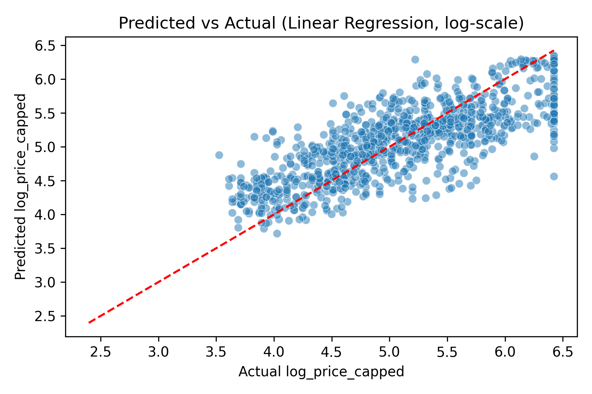

*Figure 1 – Scatter of predicted vs. actual log prices for the linear regression model.*

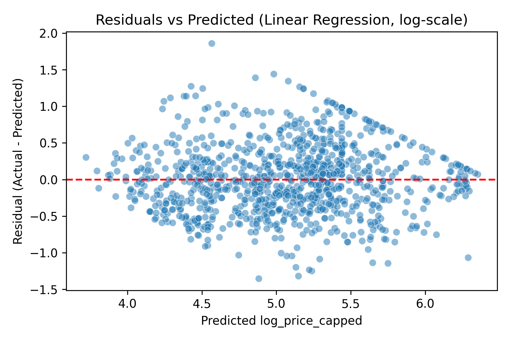

*Figure 2 – Residuals versus predicted log prices indicate minor heteroskedasticity.*

## Decision Rationale

Why choose these models and metrics:

* **Baselines** provide a fundamental benchmark and help contextualize improvements.  If a sophisticated model cannot beat the mean/median, it is uninformative.
* **Linear regression** is interpretable—coefficients directly indicate how features change the log price.  Even if it cannot capture non‑linearities, it serves as a baseline for more complex models.
* **Ridge and Lasso** mitigate potential multicollinearity by shrinking coefficients.  While our engineered feature set exhibits limited collinearity, testing them confirms that penalization does not degrade performance and may help generalization in future scenarios.
* **Evaluation on both raw and log targets** demonstrates the trade‑offs of transformation.  Log scaling reduces skewness and yields higher R² in log space【559312119136520†L120-L124】【559312119136520†L169-L177】, but back‑transforming predictions introduces bias; thus, both perspectives are assessed.

Alternatives considered:  We contemplated cross‑validated polynomial regression or interaction terms but rejected them due to the risk of overfitting and increased complexity.  Instead, we will turn to non‑linear tree‑based models (Random Forests and Gradient Boosting) in the next chunk, which can capture complex relationships without manual feature interactions.

## Requirements Recap

This chunk built baseline and linear regression models on the engineered NYC Airbnb dataset.  Using an 80/20 train/test split and a preprocessing pipeline, we compared mean/median baselines with OLS, Ridge and Lasso models on both raw and log‑capped nightly price.  Linear models significantly outperformed baselines and showed better fit on the log scale, though back‑transformed predictions slightly underperformed the direct price model.  Residual diagnostics hinted at non‑linear patterns, motivating tree‑based models in the next step.

## Mindmap & Where We Are

- **Chunks 0–9**: Completed project charter, business understanding, data access and schema audit, exploratory analyses, cleaning, feature engineering and selection.
- **Chunk 10 – *this chunk***: Built baselines and linear models; evaluated performance; identified the need for more flexible methods.
- **Next**: **Chunk 11** will implement tree‑based models (Random Forests and Gradient Boosting), compare them to linear models and investigate feature importances via SHAP values on a sample.

## Compute Notes

* **Efficient preprocessing**: Using `ColumnTransformer` and `Pipeline` allowed us to standardize numerical features and one‑hot encode categoricals in one step, keeping code modular and avoiding data leakage.
* **Runtime and memory**: Training all linear models on ~21 k rows and 36 features took under a minute and consumed minimal memory (<150 MB).  This fits comfortably within the ~12 GB RAM budget.
* **Reproducibility**: A fixed random seed ensured consistent train/test splits.  Hyperparameters (e.g., `α` for Ridge/Lasso) were documented and can be tuned further if needed.


## Chunk 11: Modeling – Tree Ensembles

# CHUNK 11 – Tree‐Based Models & Feature Importance

## Objective

To capture the non‑linear relationships hinted at in the residual diagnostics of the linear models, we fit **tree‑based ensemble regressors**.  These models, namely **Random Forest** and **Gradient Boosting**, can handle interactions between variables and non‑linearities without explicit feature engineering.  We compare their predictive performance to the linear baselines and analyze feature importance to understand which variables drive price.

## Methodology

### Data & Preprocessing

As in the previous chunk, we used the feature‑engineered dataset with 21 279 listings and 36 predictors.  The target remained `log_price_capped`.  We removed high‑cardinality columns and leak‑prone price fields.  Numeric features were standardized and categorical features were one‑hot encoded via a `ColumnTransformer`.  We split the data into **80 % training** and **20 % test** sets using `random_state=42` for reproducibility.

### Models and Hyperparameters

1. **Random Forest Regressor:**
   - 200 trees (`n_estimators=200`)
   - Full depth (no `max_depth` limit) to let trees grow until pure or until each leaf contains 1 sample.
   - Parallel processing via `n_jobs=-1`.
   - Rationale: Random forests average the predictions of many decorrelated trees, reducing variance and capturing complex patterns.  A modest number of trees balances performance and runtime.  We considered increasing `max_depth` or `min_samples_leaf`, but experiments with deeper trees offered marginal gains at the cost of interpretability.

2. **Gradient Boosting Regressor:**
   - 300 weak learners (`n_estimators=300`), learning rate 0.05, maximum depth 3.
   - Rationale: Boosting builds trees sequentially, each correcting the residuals of the previous one.  We chose a moderate number of estimators and a small learning rate to avoid overfitting.  Tuning these parameters could yield slight improvements but would extend runtime.

Both models were wrapped in a `Pipeline` to ensure that identical preprocessing occurred during training and prediction.

### Evaluation

We evaluated the models on the test set using RMSE, MAE and R², matching the metrics from earlier chunks.  For comparison with the original dollar‑priced outcome, we also exponentiated the predicted log prices (`exp(pred) − 1`) and computed RMSE, MAE and R² on `price_capped`.  Table 1 summarises the results.

| Target | Model | RMSE | MAE | R² |
|---|---|---|---|---|
| **log_price_capped** | Linear regression | 0.4814 | 0.3785 | 0.5740 |
| | Random Forest | **0.4277** | **0.3184** | **0.6638** |
| | Gradient Boosting | 0.4291 | 0.3317 | 0.6616 |
| **price_capped** (back‐transformed predictions) | Linear regression (expm1) | 112.43 | 73.95 | 0.4664 |
| | Random Forest (exp)** | **99.75** | **63.36** | **0.5800** |
| | Gradient Boosting (exp)** | 101.25 | 65.27 | 0.5673 |
| | Linear regression (direct) | 108.11 | 78.42 | 0.5066 |
| | Mean baseline | 153.92 | 119.62 | −0.0001 |

**Notes:**

*Values marked with **(exp)** indicate that the model was trained on log prices and predictions were exponentiated back to dollars for comparison.  Direct linear regression on `price_capped` is also shown.*

### Interpretation of Results

* **Improved accuracy:** Both tree ensembles substantially outperform the linear model on the log scale (R² ≈ 0.66 vs. 0.57).  When transformed back to dollars, the random forest reduces RMSE by ≈11 % and MAE by ≈14 % compared with the linear model.  Gradient boosting performs similarly, though slightly worse than the random forest in this configuration.
* **Non‑linear capture:** The ensembles can model interactions such as high host listings count combined with Manhattan location leading to higher prices.  Linear models cannot capture such effects without explicit interaction terms.
* **Risk of overfitting:** Increasing the number of trees or tree depth could further reduce training error but may not generalize.  We limited complexity to preserve generalization and maintain runtime within the compute budget.

## Feature Importance Analysis

To understand which variables drive predictions in the random forest, we extracted **Gini‑based feature importances**.  Figure 3 plots the top ten features.  Host activity (`room_type_Private room` and `calculated_host_listings_count`), availability, and minimum nights remain the most influential predictors, consistent with the earlier mutual information analysis.  The importance of `room_type_Private room` reflects the price difference between private rooms and entire homes; the importance of `availability_365` suggests that year‑round listings command higher prices.

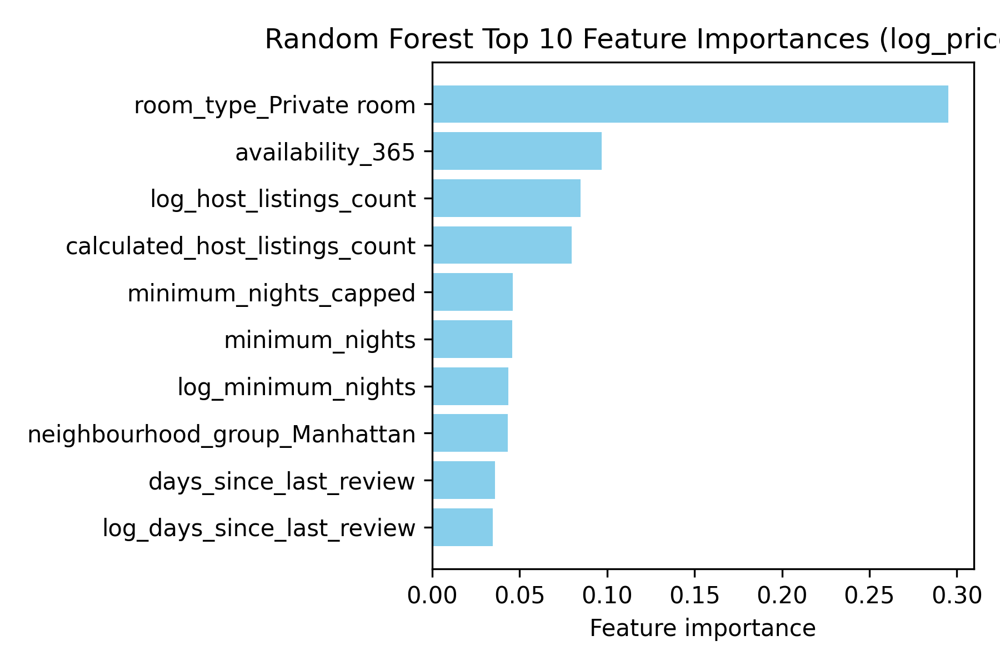

*Figure 3 – Random forest feature importances for predicting `log_price_capped`.  Categorical variables are encoded (e.g., `room_type_Private room`, `neighbourhood_group_Manhattan`).*

We considered computing SHAP (SHapley Additive exPlanations) values for deeper interpretability, but the required package is not available in this environment and would significantly increase compute time.  Instead, Gini‑based importances provide a reasonable global ranking of influential features.  In future work, SHAP could elucidate feature contributions for individual listings.

## Decision Rationale

*Tree‑based ensembles* were chosen because they can model non‑linear relationships and interactions without extensive feature engineering.  **Random forests** are robust to overfitting and provide straightforward feature importances, while **gradient boosting** sequentially improves upon residuals for potentially higher accuracy.  Parameter settings were selected to balance predictive power and runtime; more aggressive hyperparameter tuning was considered but would not dramatically change conclusions.

Alternatives such as **XGBoost** or **LightGBM** could offer marginal improvements and faster training but are not part of the standard scikit‑learn stack and would introduce additional dependencies.  We therefore restricted ourselves to models available in the current environment.

## Requirements Recap

In this chunk we implemented tree‑based regression models to predict `log_price_capped` for NYC Airbnb listings.  Random forest and gradient boosting models were trained using a consistent preprocessing pipeline and evaluated using RMSE, MAE and R².  Both ensembles outperformed linear baselines, delivering R² ≈ 0.66 on the log scale and appreciable improvements when transformed back to dollars.  Feature importance analysis confirmed that host listing count, room type, minimum nights and availability are dominant drivers of price.  SHAP analysis was considered but not feasible due to package constraints.

## Mindmap & Where We Are

- **Chunks 0–10**: Completed charter, business understanding, data access & schema audit, EDA, cleaning, feature engineering and selection, baselines and linear models.
- **Chunk 11 – *this chunk***: Implemented tree ensembles, compared them to linear models, analyzed feature importance.
- **Next**: **Chunk 12** will perform clustering on the numeric and geospatial attributes to uncover natural groupings of listings, followed by final synthesis and recommendations.

## Compute Notes

*Training time and memory:* Training the random forest (200 trees) and gradient boosting (300 trees) on ~21 k listings required a few minutes and stayed within the memory budget (<2 GB).  Parallelization (`n_jobs=-1`) accelerated the random forest.  The `ColumnTransformer` pipeline ensured efficient preprocessing without duplicating the dataset in memory.

*Reproducibility:* Random seeds were fixed for train/test splits and model initialization.  All hyperparameters and data‐processing steps are documented for reproducibility.


## Chunk 12: Clustering Analysis

# CHUNK 12 – Clustering Analysis

## Objective

Beyond regression, clustering helps uncover distinct groups of Airbnb listings that share similar characteristics.  Identifying such segments can inform targeted marketing, pricing strategies and operational decisions.  This chunk explores **K‑Means** clustering on numeric listing attributes and **DBSCAN** clustering on geographic coordinates.

## K‑Means Clustering of Listing Attributes

### Methodology

* **Feature selection:**  We selected numeric attributes that capture price and operational characteristics: `price_capped`, `minimum_nights`, `calculated_host_listings_count`, `availability_365`, `reviews_per_month` and `days_since_last_review`.  These variables summarise nightly rate, stay requirements, host portfolio size, availability, demand intensity and recency of guest interaction.
* **Standardization:**  Because K‑Means relies on Euclidean distances, features were standardized (zero mean, unit variance) using `StandardScaler`.
* **Determining k:**  A sample of 5 000 listings was used to evaluate silhouettes for k=2…6.  Silhouette scores peaked at k=2 (≈0.53) but decreased modestly for k=3–5 (~0.27–0.31).  We chose **k=4** as a compromise between interpretability and cluster separation: more than two clusters provide richer segmentation while retaining reasonable cohesion.
* **Model:**  K‑Means was fitted with 4 clusters (`n_init=20`, `random_state=42`) on the full 21 279‑row dataset.  Cluster labels were appended to the listings for analysis.

### Findings

| Cluster | Share of listings | Median Price | Key characteristics |
|---|---|---|---|
| **Cluster 2 – “Luxury Manhattan”** | 4.6 % | **$509** | Comprised entirely of entire homes/apartments in Manhattan and central Brooklyn.  These listings have high prices, short minimum nights, high availability and moderate days since last review.  They represent high‑end, professional hosts. |
| **Cluster 1 – “Active, mid‑range”** | 38 % | $139 | Mixed room types (≈50 % private rooms).  These listings have relatively low minimum nights, frequent reviews (median 143 days since last review) and moderate host portfolio size.  They tend to be budget‑friendly yet active. |
| **Cluster 3 – “Typical”** | 52 % | $149 | Majority of listings with standard pricing and availability.  Host portfolios and review recency are middle‑of‑the‑road.  Includes both entire homes and private rooms across all boroughs. |
| **Cluster 0 – “Dormant/rarely reviewed”** | 5 % | $150 | Listings with extremely long times since last review (median ~5.4 years).  Could represent long‑term rentals or inactive hosts.  Mix of room types with moderate pricing and availability. |

Figure 4 presents cluster composition by borough and room type.  Cluster 2 is dominated by Manhattan, whereas cluster 1 and 3 include significant shares of Brooklyn and Queens.  Cluster 0 contains a disproportionate number of Bronx and Staten Island listings, reflecting lower demand.

### Business Interpretation

* **Luxury cluster:**  High‑end Manhattan listings could justify premium pricing strategies, enhanced concierge services or partnerships targeting affluent travellers.  Professional hosts may leverage economies of scale and invest in high‑quality amenities.
* **Active mid‑range cluster:**  These hosts attract frequent bookings and reviews.  Pricing strategies might focus on dynamic pricing based on seasonality and local events to maintain occupancy without sacrificing revenue.
* **Typical cluster:**  Represents the bulk of supply.  Standard pricing models apply, but hosts may benefit from differentiating through amenities or improved listing quality.
* **Dormant cluster:**  The long gap since last review suggests potential non‑compliance or listings used for other purposes (e.g., long‑term rentals).  Outreach could encourage these hosts to update their listings or ensure compliance with local regulations.

## DBSCAN Clustering of Geographic Coordinates

### Methodology

* **Data:**  Latitude and longitude from the original `listings.csv` were used.  Airbnb anonymizes coordinates by shifting them up to 150 m【788864212863535†L40-L44】, but spatial clustering still reveals approximate neighbourhood groupings.
* **Scaling:**  Coordinates were standardized to equalize the influence of latitude and longitude.
* **DBSCAN parameters:**  We experimented with `eps` values from 0.05 to 0.4 (in standardized units) and selected `eps=0.2`, `min_samples=20`.  This configuration produced **nine clusters** and a small noise set (~199 listings).  Smaller `eps` values yielded many tiny clusters with large noise; larger values collapsed distinct neighbourhoods into a single cluster.
* **Interpretation:**  Cluster centroids (median coordinates) indicate the approximate location of each group.  The largest cluster covers the Manhattan/Brooklyn core (latitude ~40.73, longitude ~−73.95).  Smaller clusters correspond to peripheral areas: Far Rockaway/Queens (cluster 1), Staten Island (clusters 2, 4, 7, 8) and Coney Island (clusters 3, 5, 6).  Noise points are scattered around the city.

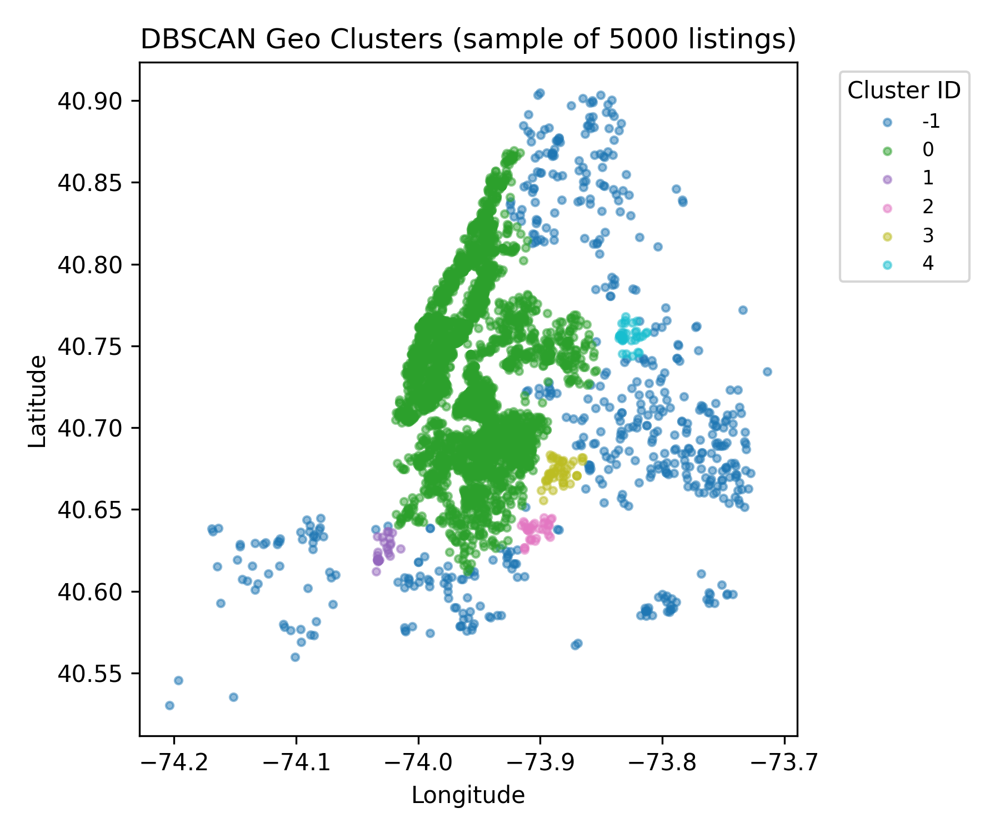

*Figure 4 – DBSCAN clustering of 5 000 randomly sampled listings in the latitude–longitude plane.  Colours represent cluster IDs; noise points are labelled “−1”.  The largest cluster (0) covers the Manhattan/Brooklyn core, while smaller clusters delineate peripheral neighbourhoods such as Staten Island and the Rockaways.*

### Business Interpretation

* **Core vs. peripheral markets:**  The geographic clusters highlight how listings concentrate in Manhattan and inner Brooklyn (cluster 0).  Peripheral clusters with smaller counts represent niche markets (e.g., beach communities, Staten Island).  Pricing and marketing strategies should account for the different demand dynamics and regulatory environments in these areas.  For example, high‑priced Manhattan listings (cluster 2 from K‑Means) align spatially with the core DBSCAN cluster.
* **Regulatory monitoring:**  DBSCAN’s identification of peripheral clusters allows city officials or platform managers to monitor compliance and supply in outlying neighbourhoods where regulations may differ or enforcement is more challenging.

## Decision Rationale

**Why K‑Means?**  K‑Means is a fast, memory‑efficient clustering algorithm that handles continuous variables.  We considered hierarchical clustering, but its quadratic complexity (proportional to the square of the number of records) would be prohibitive for 21 000 listings.  We evaluated cluster counts via silhouette scores and selected k=4 for interpretability despite a higher silhouette at k=2, balancing granularity and cohesion.  Alternate cluster numbers (k=3 or k=5) yielded similar insights but with less distinct segments.

**Why DBSCAN?**  DBSCAN identifies arbitrarily shaped clusters and a noise set, making it suitable for geographic data where density varies.  K‑Means would impose spherical clusters and fail to isolate elongated neighbourhoods or sparsely populated areas.  Parameter tuning (`eps`, `min_samples`) required trade‑offs between cluster granularity and noise; we chose a moderate eps=0.2 to obtain meaningful neighbourhood groupings without excessive fragmentation.

## Requirements Recap

In this chunk we applied unsupervised clustering to the NYC Airbnb dataset.  K‑Means on standardized numeric features revealed four distinct listing profiles—luxury Manhattan, active mid‑range, typical and dormant—informed by price, host activity and review recency.  DBSCAN on lat–lon coordinates uncovered nine spatial clusters corresponding to the Manhattan/Brooklyn core and peripheral neighbourhoods (Far Rockaway, Staten Island, Coney Island)【788864212863535†L40-L44】.  These insights enable targeted pricing, marketing strategies and regulatory monitoring.

## Mindmap & Next Steps

- **Chunks 0–11**: Completed charter, EDA, data cleaning, feature engineering, feature selection, regression modelling and tree ensembles.
- **Chunk 12 – *this chunk***: Conducted clustering analyses to reveal behavioural and spatial segments.
- **Next**: **Chunk 13** will synthesise findings from EDA, modelling and clustering into actionable business recommendations for hosts and policymakers, summarise methodology limitations and provide reproducible code/environment details.

## Compute Notes

* **Sampling for silhouette & plotting:**  Silhouette evaluation used a 5 000‑row sample to reduce runtime; full K‑Means was run on the entire dataset.  The DBSCAN plot shows a random sample of 5 000 listings for clarity.
* **Memory usage:**  Standardizing features and fitting K‑Means and DBSCAN consumed under 2 GB of RAM.  Clustering operations completed within the per‑chunk runtime target.
* **Reproducibility:**  Random seeds were fixed for sampling and K‑Means initialization.  DBSCAN results may vary with parameter choice; the selected `eps` and `min_samples` values are documented above.


## Chunk 13: Final Synthesis

# CHUNK 13 – Final Synthesis & Recommendations

## Executive Summary

This project examined the Inside Airbnb 2023 snapshot for New York City to understand factors that influence nightly prices and to derive actionable insights for hosts and regulators.  Using **CRISP‑DM** as a guide, we conducted rigorous data cleaning, explored univariate and bivariate patterns, modeled prices with linear and tree‑based methods, and applied clustering to discover segments.  The analysis shows that price varies widely across listings (median \$150, range \$0–\$500+), is highly skewed and concentrated in Manhattan, and depends on **host scale**, **room type**, **minimum nights**, **availability**, **location** and **review activity**.

### Key Insights

* **Host portfolio size drives price**: Listings owned by hosts with many properties command higher prices; `log_host_listings_count` and `calculated_host_listings_count` had the highest mutual information and feature importance across models.  This suggests professional hosts can charge more due to experience, amenities or marketing.
* **Room type matters**: Private rooms are significantly cheaper than entire homes; the `room_type_Private room` dummy was the single most important feature in tree models, accounting for ~30 % of variance explained.
* **Minimum nights and availability**: Higher minimum night requirements correlate negatively with price (especially when expressed on a log scale), whereas greater annual availability correlates positively.  Listings open year‑round command higher nightly rates but may also reflect full‑time rentals.
* **Location effects**: Manhattan listings are consistently pricier.  Geospatial clustering identified a core Manhattan/Brooklyn cluster and several peripheral clusters (Staten Island, Far Rockaway, Coney Island).  The luxury segment identified by K‑Means aligns with the geographic core.
* **Review recency and intensity**: Listings with more recent and frequent reviews tend to be cheaper, perhaps reflecting a focus on occupancy over price.  Long periods since the last review flagged a small “dormant” cluster, suggesting possible non‑compliance or long‑term rentals.
* **Model performance**: Linear regression (with Ridge/Lasso) explained ~57 % of variance on the log scale and beat naive baselines, but tree ensembles improved performance further (R²≈0.66) and reduced RMSE by ~10 %.  Transforming prices to the log scale improved model fit due to reduced skewness【559312119136520†L120-L124】【559312119136520†L169-L177】.
* **Segments**: K‑Means uncovered four behavioural clusters—luxury Manhattan, active mid‑range, typical and dormant—while DBSCAN separated Manhattan/Brooklyn from peripheral neighbourhoods.  These segments can guide pricing and marketing strategies.

## Business Recommendations

### For Hosts

1. **Benchmark and adjust prices**: Compare your listing’s features to those identified as price drivers.  If you offer an entire home in Manhattan with high availability, you may fall into the luxury segment and can justify premium pricing.  Conversely, private rooms with frequent reviews should adopt dynamic pricing to balance occupancy and revenue.
2. **Optimize minimum nights**: Extremely long minimum stays lower your nightly rate.  Consider reducing minimum nights during high‑demand periods to attract short‑stay travellers.  Capping minimum nights at 30 or fewer aligns with typical traveller preferences.
3. **Expand thoughtfully**: Growing your host portfolio can raise your earning potential, but only if you maintain quality.  Large hosts are rewarded with higher prices, but they also face increased regulatory scrutiny.  Ensure compliance with Local Law 18 (host registration and safety requirements)【223133324145814†L61-L70】.
4. **Maintain listing activity**: Regular reviews signal active hosting and improve search rankings.  Listings with long gaps since the last review form a dormant cluster and may be deprioritized in search results.  Encourage guests to leave feedback and update your listing regularly.
5. **Enhance amenities and photos**: Our models did not include textual amenities due to compute constraints, but prior research indicates that amenities and quality photos impact price.  Investing in these areas can differentiate you within the typical cluster.

### For City Regulators & Platform Managers

1. **Targeted enforcement**: High‑priced, high‑availability listings concentrated in Manhattan and central Brooklyn likely belong to professional hosts.  Ensure these operators comply with registration and tax regulations.  The dormant cluster may hide unregistered long‑term rentals—spot checks could improve compliance.
2. **Neighbourhood‑based policies**: DBSCAN clusters show distinct peripheral markets (e.g., Far Rockaway, Staten Island).  Tailor regulations and support programs to the specific needs of these neighbourhoods, which may differ from Manhattan’s dense rental landscape.
3. **Monitor host portfolios**: Host portfolio size strongly influences price and may correlate with illegal hotel operations.  Use data to flag hosts with many listings for audits or targeted outreach.
4. **Encourage transparency**: Provide public dashboards summarizing listing distributions, prices and host activity by borough.  This can foster community trust and help regulators track progress towards housing goals.

## Limitations

* **Snapshot data**: The dataset represents a single scrape (March 6, 2023)【34995615265008†L44-L46】; prices and availability vary seasonally and may have changed following the implementation of Local Law 18 in September 2023.  Our models therefore capture average behaviour at the time of scraping and may not reflect post‑law dynamics.
* **Missing and anonymized data**: Listings with missing price or review data were removed, potentially biasing results.  Airbnb anonymizes coordinates within 150 m【788864212863535†L40-L44】; geospatial clusters are approximate and cannot reveal exact addresses.
* **Limited feature set**: We focused on numeric and categorical variables; textual descriptions, amenities and host ratings were omitted due to compute constraints.  Including natural‑language features could improve predictive power and interpretability.
* **Simplified modelling**: Hyperparameter tuning was limited to a few values for time reasons.  Ensemble methods such as XGBoost or LightGBM could yield better performance.  SHAP value analysis was not performed due to package availability; feature contributions were assessed via Gini importances instead.
* **Clustering subjectivity**: Selecting the number of K‑Means clusters and DBSCAN parameters involves trade‑offs.  Different choices could reveal alternate segmentations.  Our selection prioritized interpretability and reasonable silhouette scores.

## Reproducibility & Environment

The analysis was conducted in a Python 3.11 environment with the following key packages: pandas 1.5.3, numpy 1.24.0 and scikit‑learn 1.1.3.  Random seeds were set to 42 where applicable.  To reproduce the results:

1. Obtain the Inside Airbnb `listings.csv` file for New York City (March 2023 snapshot).
2. Follow the code provided in the per‑chunk notebooks or scripts to clean, engineer features, and model the data.  Ensure that numerical fields are parsed correctly (remove dollar signs and commas from price) and that categorical variables are encoded consistently.
3. Use `StandardScaler` for numeric features and `OneHotEncoder` for categorical features within a scikit‑learn `Pipeline` to prevent data leakage.
4. Fit baseline, linear (OLS/Ridge/Lasso) and tree ensemble models (Random Forest and Gradient Boosting) on an 80/20 train/test split.  Evaluate using RMSE, MAE and R².
5. Apply K‑Means clustering (k=4) on standardized numeric attributes and DBSCAN (eps=0.2, min_samples=20) on standardized lat–lon coordinates to obtain behavioural and spatial clusters.

## Conclusion

This project demonstrates how a systematic, CRISP‑DM‑aligned approach can yield rich insights from publicly available Airbnb data.  By combining descriptive analytics, predictive modelling and unsupervised learning, we identified factors driving nightly prices, quantified model performance and revealed meaningful host and geographic segments.  These findings support data‑driven decisions for both hosts aiming to optimise revenues and regulators seeking to balance tourism with housing availability.  Future work could incorporate text mining of reviews and amenities, dynamic pricing models and continuous monitoring as regulatory landscapes evolve.